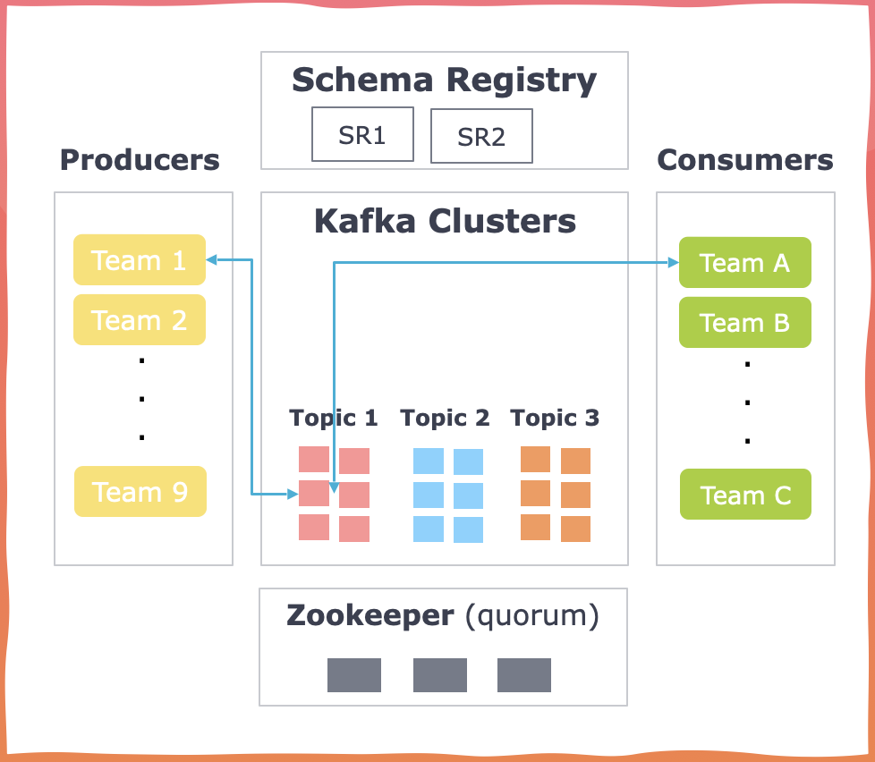
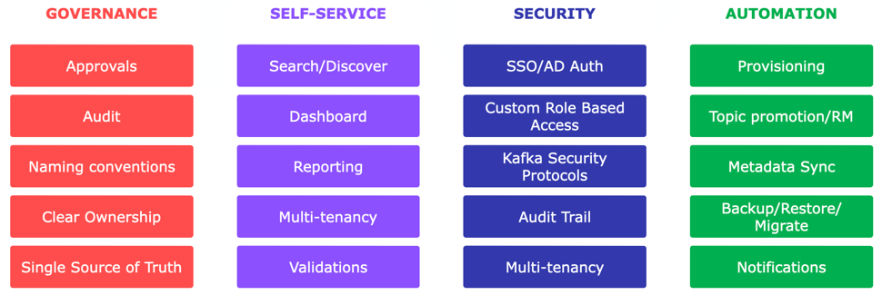

## Background

In today's ever-evolving technological landscape, organizations
worldwide have adopted Apache Kafka® for its unparalleled scalability
and exceptional features, leading to a paradigm shift in how messaging
systems are handled. As more and more organizations adopt Apache Kafka as a
vital component of their technology stacks, the need for effective Apache Kafka
governance becomes paramount.

```bash
A common challenge companies face is the inability to effectively govern
and manage access permissions for the numerous topics created,
often numbering in the hundreds or even thousands.
```

Managing Apache Kafka topics poses significant challenges for companies, often
leading to struggles executing the task effectively. Several crucial
considerations arise when undertaking this endeavor:

- **Authorization and ownership**: Determining who has the rights to
  produce and consume messages on a specific topic and establishing
  clear ownership are crucial aspects to address.
- **Configuration backup and restoration**: Establishing robust
  strategies for backing up and restoring Apache Kafka's configuration is
  essential to ensure prompt recovery in the face of failures or
  system disruptions.
- **Security measures**: Ensuring the proper enforcement of security
  measures through subscriptions and access controls is paramount to
  safeguarding sensitive data and preventing unauthorized access.
- **Topic promotion**: Navigating the process of smoothly promoting
  topics with thoroughly tested configurations from lower environments
  to production requires careful planning and coordination.
- **Enhancing visibility and awareness**: Increasing the visibility
  and awareness of topics within the organization facilitates better
  collaboration and knowledge sharing among teams.

Managing a small number of Apache Kafka topics may seem manageable at first.
However, as Apache Kafka usage grows and more applications and teams are added,
effective and efficient management can become increasingly challenging.
This includes the important task of isolating sensitive topics
containing GDPR, HIPAA, or other types of sensitive data. It is
essential to ensure that only authorized applications can access these
topics to maintain data security and regulatory compliance.

## Typical challenges

The current system faces several challenges that impede efficiency and
effectiveness, posing risks and hindering productivity. Identifying and
addressing these typical challenges can enhance operations and optimize
overall performance.

Let's explore the key challenges that need to be addressed:

- Manual activities

  Creating, accessing, and promoting a topic to a higher environment requires extensive email communication, involving
  approximately 10 emails. This manual approach consumes valuable time and increases potential errors and
  miscommunication.

- Longer lead time

  The end-to-end communication and execution of the manual activities take approximately 2.5 hours, excluding the time
  spent waiting for human responses. This long lead time hampers efficiency and slows down the overall workflow.

- Security

  The system faces Role-Based Access Control (RBAC) and data security-related challenges. Ensuring proper access rights
  and safeguarding sensitive information is crucial for maintaining the integrity and confidentiality of the system.

- Lack of audit

  No proper auditing mechanism is in place to track and monitor requests. This lack of audit trails creates an
  accountability gap, making identifying and rectifying potential issues or discrepancies challenging.

- Adhoc governance

  The absence of a centralized governance setup adds complexity to the system. All actions are initiated through emails,
  and the request approver list is maintained in spreadsheets or confluence.

- Release management

  The manual release processes, mainly promoting configurations from one environment to another, introduce a significant
  risk of errors. These errors can cause system outages, leading to disruptions in service and impacting user
  experience.



### Navigating Apache Kafka system failures

Failures are an inevitable part of any system, and Apache Kafka applications
are no different. These failures can occur at different levels,
including client-side issues where event deserialization creates
problems for consumers, as well as infrastructure-related issues that
result in the loss of zookeeper/Apache Kafka configurations.

In the context of infrastructure failures, let's consider a scenario
with 1000 topics, each possessing a unique configuration stored in a
zookeeper. Now, imagine a situation where a disaster strikes, causing
the zookeeper to crash and be unable to recover. This raises a critical
question: how swiftly can you retrieve the information and reboot your
server? It's not just about having methods to store information but
also about strategically implementing storage and retrieval processes
for efficient recovery.

### How to mitigate these problems?

To ensure a fail-safe Apache Kafka system, it is crucial to mitigate these
challenges by implementing a robust governance platform. This platform
should encompass the following essential capabilities:

- **Comprehensive visibility**: Providing a holistic view of topics,
  producers, consumers, schemas, and connectors.
- **Secure configuration management**: Implementing a four-eye
  principle-based system for reviews and approvals to maintain the
  safety and consistency of configurations.
- **Notifications**: Alerting users about changes to schemas and other
  configurations.
- **Action tracking**: Maintaining a detailed record of actions
  performed by different users for transparent accountability.

## Klaw

Klaw is a comprehensive toolkit designed to address the challenges Apache Kafka
developers encounter. It provides solutions for compliance and audit
concerns, data security, and release management.

Developed as an open tool, Klaw is committed to contributing to the
streaming community by empowering developers to leverage modern
governance, control, and security practices while building Apache Kafka
applications.

### Klaw features

Klaw is built upon four essential pillars, which serve as the foundation
for its capabilities.

`Governance` - `Self-service` - `Security` - `Automation`



- **Governance**: Ensures accountability and consistency with
  approvals, audit trails, naming conventions, clear ownership, and a
  single source of truth.
- **Self-service**: Empowers developers with search, customizable
  dashboard, reporting, and multi-tenancy for efficient resource
  management and data integrity.
- **Security**: Offers SSO/AD authentication, RBAC, Apache Kafka Security
  protocols, audit trails, and multi-tenancy to address diverse
  security needs.
- **Automation**: Streamlines tasks like resource provisioning, topic
  promotion, metadata sync, backup/restore, and notifications for time
  and cost savings.

#### Benefits of Klaw

- **Reduced dependency**: By reducing dependency on infrastructure
  teams and empowering developer teams, Klaw enables faster execution
  and decision-making, saving time, cost, and effort.
- **Zero risk of manual errors**: With full self-service capabilities,
  Klaw eliminates the risk of manual errors, ensuring data accuracy
  and cost savings.
- **Continuous integration**: Klaw enables continuous integration by
  promoting topics and schemas to higher environments, ensuring
  consistency throughout the development pipeline.
- **Secure authentication**: Klaw authenticates users based on an
  organization's single sign-on (SSO) or Active Directory (AD),
  providing a secure access control mechanism.
- **Tailored security features**: Klaw offers robust security features
  that cater to the specific needs of different types of
  organizations, ensuring data protection and compliance.

### Klaw project resources

[Project GitHub repository](https://github.com/aiven/klaw)

[Git issues](https://github.com/aiven/klaw/issues)

[Contribute](https://github.com/aiven/klaw/blob/main/CONTRIBUTING.md)

[Documentation](https://www.klaw-project.io/docs)

[Community](https://aiven.io/community/forum/tag/klaw)

[Docker Klaw Core](https://hub.docker.com/r/aivenoy/klaw-core), [Docker Klaw Cluster API](https://hub.docker.com/r/aivenoy/klaw-cluster-api)

## Conclusion

Organizations are devising unique strategies to tackle the growing
complexity of managing an increasing number of Apache Kafka topics, schemas,
and associated issues. These strategies involve using tools like Excel,
Confluence, and GitOps for partial data maintenance.

For a comprehensive and streamlined solution that simplifies the tasks
for both developers and admins, Klaw stands as a highly effective
one-stop solution.

```bash
It's free and  open source.
```
