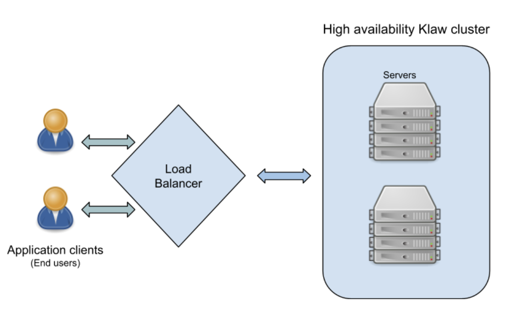
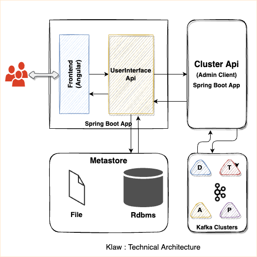
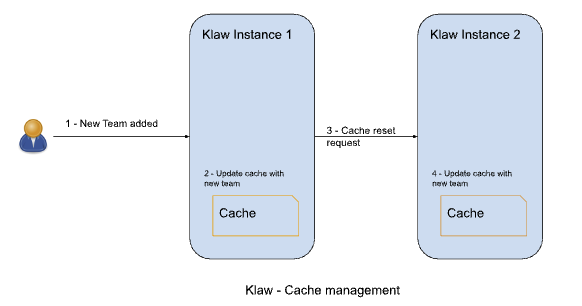

## Background

In today's dynamic and ever-changing digital landscape, maintaining the
uninterrupted operation of applications is of the highest importance.
This blog post explores the configuration of Klaw, a Java-based
application designed specifically for Kafka governance.

Our primary focus is on exploring the configuration process for
achieving high availability (HA) in production environments. By
implementing these measures, we can ensure continuous operation, enhance
reliability, and deliver a seamless user experience, even during
unexpected failures.

### Why High Availability matters

High availability (HA) is a design principle to ensure operational
continuity over a given period. For Klaw, being an essential tool in
managing and monitoring Kafka clusters, the application must be
resilient to potential system failures. Achieving high availability for
Klaw means eliminating single points of failure and ensuring minimal or
no downtime, thereby leading to a more reliable Kafka governance.
Unforeseen events and emergencies can cause server failures, affecting
even the most robust systems. By supporting high availability, Klaw is
equipped to automatically recover from component failures, thereby
reducing the impact of these events and providing users with a seamless
experience.

### Importance of High Availability in Klaw

Kafka clusters can be complex and substantial, making effective
management and monitoring crucial. A failure in these operations can
lead to significant issues. By configuring Klaw with high availability,
it becomes a reliable Kafka governance tool that ensures uninterrupted
operations, even in the face of underlying system failures. Deploying
Klaw with high availability minimizes or eliminates downtime and
provides continuous support for Kafka cluster management, enhancing
overall system reliability. With this understanding of high availability
and its critical role in Klaw, let's explore the architectural design
that supports it, the internal components of Klaw, and how to configure
Klaw for high availability.

### What Problem Does High Availability for Klaw Solve?

Before diving into what High Availability is, let's understand why
it's crucial for Klaw. As Klaw is essential in managing and monitoring
Kafka clusters, ensuring its resilience against potential failures is
paramount. Downtime can have dire consequences ranging from slight
inconveniences to lost revenue and a damaged reputation. High
Availability for Klaw addresses these critical issues:

- Minimizing downtime: By eliminating single points of failure and
  ensuring redundancy in the system, HA for Klaw minimizes or
  eliminates downtime.
- Scalability: As the workload increases, Klaw can handle a higher
  number of requests, catering to a growing user base, thanks to the
  HA configuration.
- Data availability: Ensuring that the data is always available, even
  in the case of component failures, is crucial. HA ensures the data
  is replicated across different servers, safeguarding against data
  loss.
- Service continuity: In the event of a disaster or system failure, HA
  ensures that there is no interruption in service and the operations
  continue without a hitch.
- Enhanced user experience: Constant availability and reliability
  improve user experience, which is vital for customer satisfaction
  and retention.

## What is high availability?

High availability (HA) is a design approach that guarantees a certain
degree of operational continuity during a given measurement period.
It's about ensuring that applications remain available even if a
critical component, such as a server, fails. Essentially, high
availability eliminates any single point of failure and ensures minimal
or no downtime. Why is high availability important? Deploying
applications with high availability in production environments is
essential for minimizing or eliminating downtime. Unforeseen events and
emergencies can cause server failures, affecting even the most robust
systems. HA systems are designed to automatically recover from component
failures, reducing the impact of these events.

### High availability architecture

Ensuring systems can handle higher workloads and substantial traffic is
undeniably vital. However, it is equally essential to identify potential
failure points and minimize downtime. A key component in achieving this
goal is a highly available load balancer, which plays a significant
role. It involves implementing a scalable infrastructure design that
adapts to increased traffic demands. This often consists of employing a
software architecture that surpasses hardware limitations.



Load balancing involves automatically distributing workloads across
system resources, such as assigning various data requests to different
servers.

In a highly available (HA) system, servers are organized in clusters and
arranged in a tiered architecture to handle requests from load balancers
efficiently. If a server within a cluster experiences a failure, a
replicated server in a separate cluster can seamlessly take over the
workload initially assigned to the failed server. This redundancy allows
for failover, where a secondary component assumes the responsibilities
of a primary component upon failure while minimizing any adverse effects
on performance.

## Understanding Klaw

This section provides an in-depth overview of Klaw's architecture, the
inner workings of its application, and the various perspectives it
offers to users.

### Klaw architecture

Klaw is a web application developed using Java, compatible with JDK
17/19. The application's front end is initially built using AngularJS,
but an upgrade to React JS is underway. The Backend development is
carried out using Spring Boot. Klaw relies on an RDBMS-based data store
for managing metadata. In its default configuration, Klaw employs a file
based H2 database for storing metadata.



### Klaw internal components

Klaw is composed of two primary Java applications: the Governance Layer
and the Cluster Layer.

- Governance layer

The governance layer is an integral part of Klaw, responsible for
handling user interfaces and APIs.

User interface components: Allows users to interact with Klaw's
features through a web interface. APIs and Authorization: The APIs in
the governance layer are responsible for authorizing requests and
interacting with the metastore (database). Upon approval, the
application communicates with the Cluster API application.

Security: The communication between APIs in the Governance Layer and
the Cluster Layer is highly secure. JWT token-based authentication is
used to ensure that no external user can interact directly with it.

User Roles and Permissions: Every user in Klaw is associated with a
role and a set of permissions. Additionally, users can be part of
multiple teams and have the flexibility to switch between them.

- Cluster layer The Cluster Layer is the second Java application within
  Klaw.
  Communication: This layer is a Java application that communicates with the Governance Layer and Kafka clusters (Kafka,
  Schema Registry, Kafka Connect).

- User interface switch: By default, users are logged into the
  AngularJS-based interface. However, they have the option to switch to
  the React JS interface. Building React assets requires npm, pnpm, and
  node.

- Metastore Klaw organizes data in the database into three categories:

Admin data: Comprises users, roles, permissions, teams, tenants,
clusters, environments, properties and other product related details.

Core data: Comprises Topics, ACLs, Schemas and Connector
configurations.

Requests data: Comprises requests of Topics, ACLs, Schemas and
Connectors.

- Cache Klaw stores most frequently queried data in a local cache to
  for improved performance and user experience. This effectively reduces
  latency and gives users immediate response from the application.
  However, this cache is reset whenever changes are requested. Deploying
  Klaw in different environments like Development, Testing, Acceptance,
  and Production is essential to streamline the developer experience.



### System requirements

For optimal performance of Klaw, we recommend the following system
requirements. These specifications assume a user base of approximately
100 or more, with around 50 or more Kafka clusters and over 10,000
topics.

Core Governance Application / Cluster Application

    | ------------------------ ------ ------------ |
    | Deployment environment   | RAM  |  CPU       |
    | ------------------------ ------ ------------ |
    | Development              | 2 GB |  Dual-core |
    | ------------------------ ------ ------------ |
    | Testing                  | 2 GB |  Dual-core |
    | ------------------------ ------ ------------ |
    | Production (HA)          | 4 GB |  Dual-core |
    | ------------------------ ------ ------------ |

### Database management system

For the RDBMS, Klaw is compatible with various database management
systems such as PostgreSQL®, MySQL, and others.

Note: While the above configurations have been tested and proven to work
effectively, there are no guarantees that they will suit every use case.
The actual performance and suitability depend on various factors,
including the operating system, CPU utilization, and other processes
running on the virtual machines.

### Deployment model

To further enhance the system's reliability, deploying the Governance
Application and the Cluster API Application on separate machines is
recommended. This setup minimizes the risk of both applications being
affected by a single point of failure.

With the understanding of Klaw's working mechanism, let's explore how
to deploy Klaw in high-availability production-like environments using
the Nginx load balancer.

## Nginx load balancer

In this section, let's explore how to achieve high availability for
Klaw using Nginx as the load balancer. Nginx serves as an efficient HTTP
load balancer, distributing traffic across multiple application servers,
thereby enhancing the performance, scalability, and reliability of web
applications.

### Load balancer methods

Nginx supports three types of load balancing methods:

- Round-robin: Requests are distributed among the application servers
  in a cyclic manner.
- Least-connected: The next request is directed to the server with the
  fewest active connections.
- IP-hash: A hash-function based on the client's IP address is used
  to determine the server to which the next request should be sent.

Detailed information can be found on the official Nginx documentation.

### Database authentication in Klaw

In Klaw, you can configure database-level authentication by setting
`klaw.login.authentication.type: db` in the core mode
application properties.

With database authentication, Klaw uses the Spring JSESSION ID. When
deploying Klaw in HA mode across more than one instance to ensure
uninterrupted user access, it's advisable to configure the IP-Hash load
balancing method.

Below is an example of Nginx configuration using the IP-Hash method:

### Nginx configuration

```nginx
upstream klawgcp {
    ip_hash; // load balancing method
    server klawhost1:9097;
    server klawhost2:9097;
  }
  server {
    listen 80;
    listen [::]:80;
    ssl on;

    ssl_certificate     /opt/klaw/certs/service.cert;
    ssl_certificate_key /opt/klaw/certs/service.key;
    ssl_protocols TLSv1.2;
    server_name serverhost;
    location / {
          proxy_pass https://klawgcp;
      }
   }
```

Using IP-Hash method, sessions are maintained by tracking the client's
IP address. Single Sign-On (SSO) authentication in Klaw For SSO
authentication, configure Klaw by setting
`klaw.login.authentication.type: ad` in the core mode
application properties. When SSO is enabled, either Round-Robin or
Least-Connected load balancing methods can be used.

Below is an example Nginx configuration using Round-Robin load
balancing:

```nginx
upstream klawgcp {
        round-robin; // load balancing method
        server klawhost1:9097;
        server klawhost2:9097;
    }
    server {
            listen 80;
            listen [::]:80;
            ssl on;

            ssl_certificate     /opt/klaw/certs/service.cert;
            ssl_certificate_key /opt/klaw/certs/service.key;
            ssl_protocols TLSv1.2;
            server_name serverhost;
            location / {
                    proxy_pass https://klawgcp;
                }
    }
```

### Klaw deployment model in high availability (HA) mode

In the high availability mode, Nginx routes the requests to Klaw
instances which are connected to a common data store such as Postgres.
Each Klaw instance comprises both the Governance and Cluster API
applications. You may choose to deploy these applications on separate
machines for increased robustness. Below is the deployment model of Klaw
in HA mode.

Klaw in HA mode with Nginx Load balancer

### Klaw configuration

While Klaw stores all metadata in a database, most of this data is
usually cached for quicker access. Therefore, it's important to reset
this cache whenever any changes are made to the configuration of topics,
ACLs, etc.

To ensure proper cache reset across Klaw instances, you must configure
the following property with the comma-separated list of instance hosts:

> `klaw.uiapi.servers=https://klawhost1:port,https:klawhost2:port..`

This configuration ensures all requests are directed to the various Klaw
instances using the Nginx load-balancing configuration.

#### Other Load Balancers

Spring Cloud Load Balancer: Allows client-side load balancing. For more
information, see the official guide.

Netflix Ribbon: Provides client-side load balancing for Spring Boot
applications. See the GitHub repository for more details.

AWS Load Balancer: AWS offers a variety of load balancers based on
network, containers, applications, and target groups. Choose the
appropriate one based on your requirements. Learn more on the official
AWS page.

### Klaw project resources

[Project GitHub repository](https://github.com/aiven/klaw)

[Git issues](https://github.com/aiven/klaw/issues)

[Contribute](https://github.com/aiven/klaw/blob/main/CONTRIBUTING.md)

[Documentation](https://www.klaw-project.io/docs)

[Community](https://aiven.io/community/forum/tag/klaw)

[Docker Klaw Core](https://hub.docker.com/r/aivenoy/klaw-core), [Docker Klaw Cluster API](https://hub.docker.com/r/aivenoy/klaw-cluster-api)

For any questions or discussions, please open an issue on GitHub or
participate in our Community forum.

**It's free and open source.**
