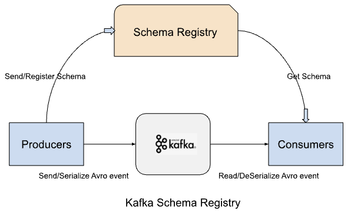
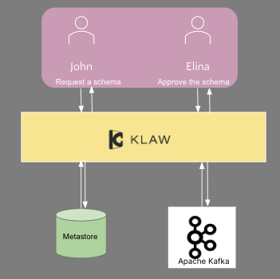

This article explores the significance, evolution, and management of schemas in Klaw. It also covers how Klaw safeguards
organizations against data loss by creating schema backups for disaster and failure recovery.

## Schemas

Data governance is becoming increasingly important for organizations that want to improve data quality, comply with
regulations, and strengthen security. One way to achieve this goal is by setting up internal benchmarks, regulations
for data, and schemas.

Schemas provide a clear understanding of what to expect from information, guiding their engagements and the
relationships among objects. This guidance enables streamlined access, modification, and querying of data.

Furthermore, a schema outlines both the visual representation and structural organization of the data.

### Apache Kafka context

Within the Apache Kafka ecosystem, schema registries such as Karapace and Confluent's Schema Registry play a key role in the
management and validation of schemas. Furthermore, they provide a RESTful interface to manage schema and their evolution
processes effectively.

Apache Kafka is a distributed streaming platform that allows producers to write data to topics and consumers to read
from them. When there are structural changes to the data, it is important to establish an understanding between the
producers and consumers to ensure that events are processed successfully.

The below image depicts the communication between Schema Registry, Apache Kafka, Producers and Consumers.



Producers can register a schema based on a specific configuration, or they can use the REST API provided by the Schema
Registry. During this process, events are serialized and validated against the currently registered schema.
Subsequently, consumers deserialize the event and transform it into a standardized record in line with one of the
registered schemas, as determined by the consumer's settings.

### Schema id

In Apache Kafka events, you can create schemas for both keys and values. This allows for the generation of key schemas and value schemas. Once a schema is registered, it is automatically stored in the default \_schemas topic of Apache Kafka and is assigned a unique identifier.

If the same schema is registered on another topic, it will link the previously registered schema using the same
identifier. This identifier becomes an integer value generated upon successfully registering the schema.

To retrieve a schema based on an id: `GET /schemas/ids/{int: id}/schema`

### Schema Strategy

Apache Kafka offers various strategies for schema registration, with the default being the `TopicNameStrategy`. In this
approach, the subject name corresponds to the Apache Kafka topic name. In this strategy, typical subject names include
"topic-key" or "topic-value."

Example of an Avro schema

```json
{
  "type": "record",
  "namespace": "customer.account",
  "name": "CustomerAccount",
  "fields": [
    {
      "name": "Name",
      "type": "string"
    },
    {
      "name": "Age",
      "type": "int"
    }
  ]
}
```

Key schemas are usually strings by default, but you can register key schemas explicitly if needed. Apache Kafka supports
alternative strategies, such as `RecordNameStrategy` and `TopicRecordNameStrategy`.

### Schema evolution

When you initially register a schema, the need for expansion and scalability arises as application requirements evolve.
To manage this growth effectively, Apache Kafka consumers must be able to process events using both existing and newly
registered schemas, thereby avoiding deserialization issues.

A key feature is accommodating multiple schema versions and allowing consumers to seamlessly deserialize Apache Kafka records
according to the registered schema and event structure. This dynamic feature enables producers and consumers to generate
and process events at scale while ensuring compatibility efficiently. It is important to note that each new schema
version is assigned a unique identifier.

Supported compatibility types include BACKWARD, BACKWARD_TRANSITIVE, FORWARD, FORWARD_TRANSITIVE, FULL, FULL_TRANSITIVE,
and NONE.

You can configure schema compatibility settings at both the subject and global levels. The system defaults to the global
setting if you don't specify subject-level compatibility.

To check the compatibility status, you can use the following APIs:

- `GET /config    (global)`
- `GET /config/(string: subject)`

### Rest interface

A REST interface is accessible for schema management, enabling tasks such as registering a new schema, submitting
updates to it, deletion, and more.

- `GET /subjects`
- `POST /subjects/(string: subject)/versions`

Here is a detailed documentation :

- [**Karapace**](https://github.com/Aiven-Open/karapace#quickstart)
- [**Confluent**](https://docs.confluent.io/platform/current/schema-registry/develop/api.html#schemas)

## Schema management in Klaw

In Klaw, each Apache Kafka topic is associated with a specific owner, usually a designated team. The owner team is
automatically granted the role of schema owner, giving them the authority to create new schemas and oversee their
evolution.

Klaw ensures data consistency, reliability, and secure access, aligning with organizational policies. It also controls
schema registration, permitting only the designated owner to manage schemas and preventing unauthorized modifications
by other teams.

### Request for a Schema in Klaw

After creating a topic, the designated team that owns the topic gains the exclusive right to register a schema for it.
As the topic owner, you have the authority to approve, initiate, or reject any schema-related requests for that topic.



For more information on registering a schema **[see here](../../../docs/HowTo/schemas/Request-a-schema)**

Watch the video below for a step-by-step demonstration of registering a schema in Klaw.

<!-- markdownlint-disable-next-line MD033 -->
<iframe src="https://drive.google.com/file/d/1g_wngVYcSgtGIWjwMxNT0ck--zGIKuew/preview" width="640" height="480" allow="autoplay"></iframe>

### Schema migration from Schema registry to Klaw

Backing up schemas from the schema registry is essential for ensuring recovery in the event of server failures or
unexpected disasters. While schemas are typically stored in a Apache Kafka topic with replication, there may be cases where
retrieving them is difficult or impossible.

Klaw simplifies this by connecting directly to the schema registry server, retrieving all available schemas associated
with topics, and integrating them into its metastore. This backup process is straightforward and takes only a few
clicks, regardless of the volume of schemas or topics.

For more information on synchronizing schemas from the schema registry to Klaw, refer to
**[sync-schemas-from-cluster](../../../docs/HowTo/kafka-cluster-migration/sync-schemas-from-cluster)**

The following video demonstrates how schemas are synchronized to Klaw for a selection of topics already present in
Karapace.

<!-- markdownlint-disable-next-line MD033 -->
<iframe src="https://drive.google.com/file/d/1iSkAUd7jVD7Zt6OH_-Gc2NGyIbpXi2VK/preview" width="640" height="480"
allow="autoplay"></iframe>

### Schema migration from Klaw to Schema Registry

After successfully backing up schemas in Klaw, you have the flexibility to register them either to a new schema registry
cluster or integrate them into an existing one.

Select the schemas you want to sync with the cluster. Once you submit your choices, Klaw will register the selected
schemas directly into your designated schema registry environment.

For more information on this synchronization process, refer to
**[sync-schemas-to-cluster](/docs/HowTo/kafka-cluster-migration/sync-schemas-to-cluster)**

The following video demonstrates migrating schemas to a Schema Registry, specifically focusing on a couple of subjects
already stored in Klaw.

<!-- markdownlint-disable-next-line MD033 -->
<iframe src="https://drive.google.com/file/d/1TAxmgJSkSfCKYrYIDL_DUSR5wb4jMlzv/preview" width="640" height="480" allow="autoplay"></iframe>

## Conclusion

Given the critical importance of data quality, protection, compliance, and management in every organization, Klaw
provides a robust foundation for building a resilient data governance framework. With its automated features, Klaw
empowers data teams to organize data, ensuring consistent accessibility, robust security, and unmatched reliability.
