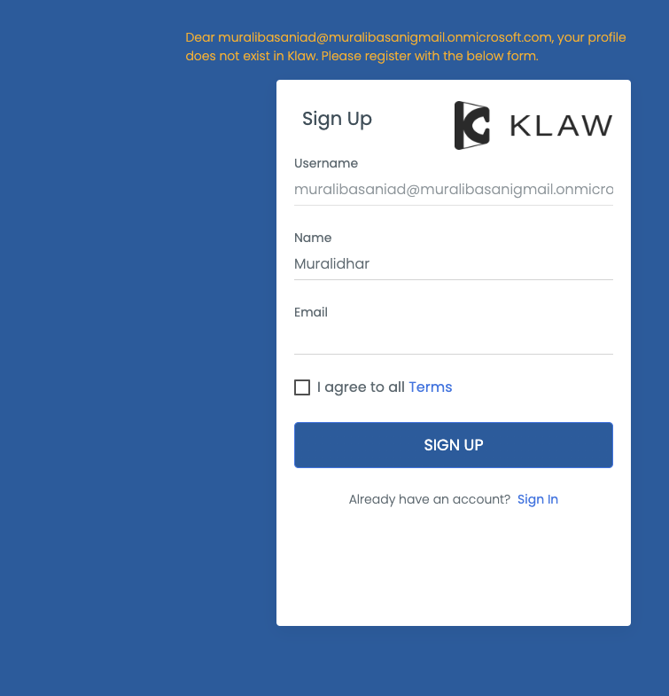

# Login with Azure AD

You can log in to Klaw with your credentials configured in the Azure
Active directory. On the login screen, you are prompted with a login
option for Azure AD. After clicking on the login button, you are
provided with an Azure pop-up window with options to provide your
credentials or select an Azure account.

Before using Azure AD to log in with Klaw, you need to make the
following configurations in the `application.properties` file in
Klaw Core module to enable Azure AD.

1.  Make sure Klaw is running in a secure mode. You will find the
    following configuration: `server.ssl.key-store.`

2.  Configure the
    authentication type by setting the value to `ad` in the following
    property: `klaw.login.authentication.type=ad`

3.  Enable SSO by setting the value to `true` in the following
    property: `klaw.enable.sso=true`

4.  To enable Azure AD-based authentication, uncomment the following
    properties and provide the appropriate values for ClientId, Client
    secret, and Tenant Id:

        # Uncomment the below OAuth2 configuration to
        enable Azure AD based authentication
        #spring.security.oauth2.client.registration.azure.client-id=
        #spring.security.oauth2.client.registration.azure.client-secret=
        #spring.security.oauth2.client.registration.azure.redirect-uri=https://localhost:9097/login/oauth2/code/
        #spring.security.oauth2.client.registration.azure.provider=azure-active-directory
        #spring.security.oauth2.client.registration.azure.scope=openid, profile,
        email
        #spring.security.oauth2.client.provider.azure-active-directory.issuer-uri=https://login.microsoftonline.com/{tenantid}/v2.0

5.  Configure an existing SUPERADMIN user from AD to approve new users
    in the following property for username:

        klaw.superadmin.default.username=superadmin@company.com

6.  If you have already signed up with Azure AD, you will be redirected to the Klaw home page.

    

    Enter your credentials in the Azure login window.

    

7.  If this is your first time logging in, you will be presented with a signup form to fill in. On submission, the Klaw Administrator will approve or decline your request.

    
