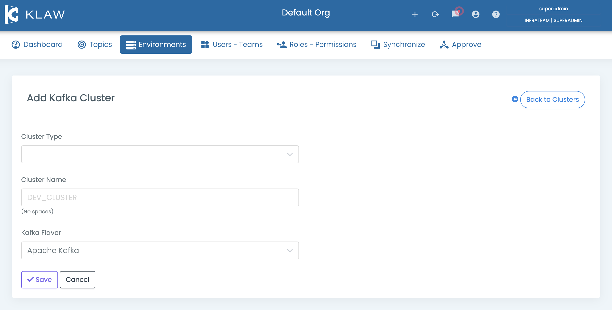
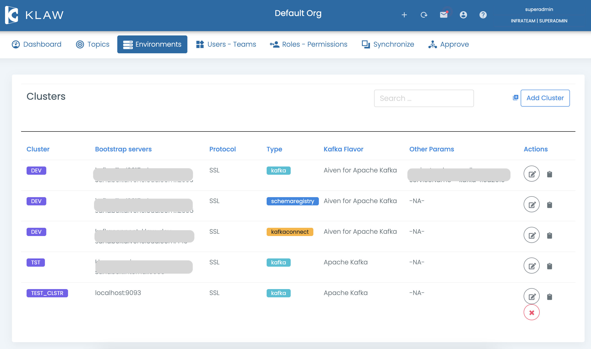

# Manage clusters

In Klaw, clusters are used to store the connectivity information of
servers. There are three types of clusters that you can define in Klaw:

<!-- vale off -->

- Apache Kafka
- Schema Registry
- Apache Kafka Connect
<!-- vale on -->

Depending on the type of cluster, you can need to configure various
settings, such as protocol, bootstrap servers, REST API URLs, and Apache Kafka®
flavors.

## Prerequisite

To manage clusters in Klaw, including adding, deleting, or updating, you
need to log in using a SUPERADMIN account or an account with the
`ADD_EDIT_DELETE_CLUSTERS` permission.

## Add new cluster

To add a new cluster in Klaw, follow these steps:

1. Log in to Klaw.
2. Navigate to the **Environments** tab and select **Clusters**.
3. On the **Clusters** screen, select **Add Cluster**.
4. On the **Add Kafka Cluster** screen, provide the following information:

   - **Cluster type**: Choose a cluster type from the dropdown menu (Kafka, Schema Registry, or Kafka Connect). Based
     on the cluster type, you need to include additional information.
   - **Cluster name**: Enter a name for the cluster, for example, `Dev_cluster`.
   - **Kafka flavor**: Select a Apache Kafka flavor from the dropdown list.
     - Provide the additional information required based on the **cluster type**:
       - If you are adding a **Kafka cluster**, enter the following:
         - **Protocol**: Select either plaintext or SSL.
         - **RestAPI servers**: Enter the URL of the REST API servers, for example, `https://server:12695`.
         - **Bootstrap servers**: Enter the comma-separated list of bootstrap servers, for
           example, `server1:9092,server2:9092,server3:9092`.
       - If you are adding a **Schema Registry cluster**, enter the following:
         - **Protocol**: Select either plaintext or SSL.
         - **Bootstrap servers**: Enter the comma-separated list of bootstrap servers.
       - If you are adding a **Kafka Connect cluster**, enter the following:
         - **Protocol**: Select either plaintext or SSL.
         - **Kafka Connect servers**: Enter the URL of the Apache Kafka Connect servers, for example, server1:8083.

5. Select **Save** to create the new cluster. A new cluster is now
   created.

## Update cluster

To update a cluster, follow these steps:

1. Log in to Klaw.
2. Navigate to the **Environments** tab and select **Clusters**.
3. Click the **Edit** icon in the **Actions** column for the cluster
   you want to update.
4. Modify the necessary details.
5. Select **Save** to confirm your changes. The cluster is updated with
   the new information.

## Delete Cluster

To delete a cluster, follow these steps:

1. Log in to Klaw.
2. Navigate to the **Environments** tab and select **Clusters**.
3. Click the **Delete** icon in the **Actions** column for the cluster
   you want to delete.

   You can only delete clusters that are not associated with any environment. If a cluster is associated with any
   environment, you must remove the environment association before deleting the cluster.

4. On the confirmation screen, select **delete** to confirm the deletion of
   the cluster. The selected cluster is deleted.

