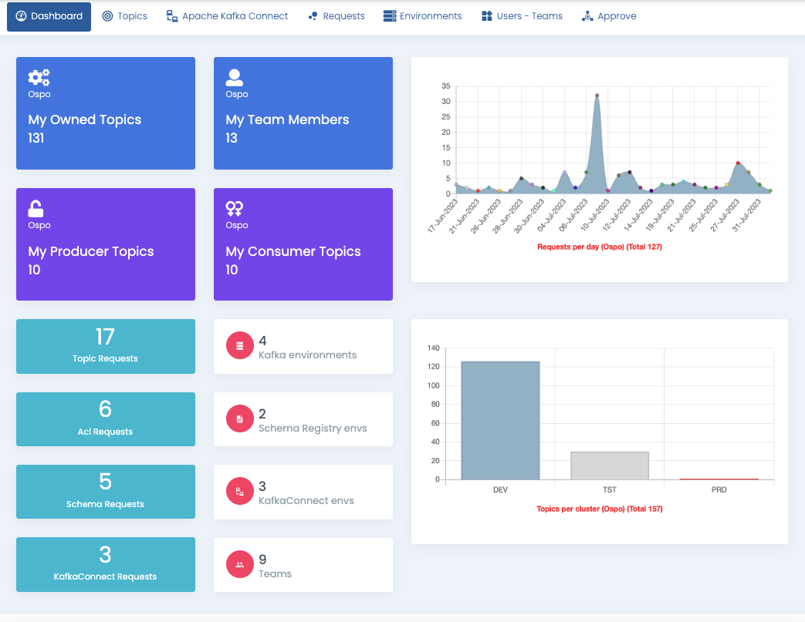

# Dashboard

Klaw dashboard displays the below (in old UI)

- My Owned topics : Topics owned by your team
- My Team members : Members of your team
- My Producer topics : Your team have producing acls on to those topics
- My Consumer topics : Your team have consumer acls on to those topics
- Pending requests : Requests which need an action like Topics requests, Acl requests, Schema and Connector requests
- Requests per day : Requests per day from your team
- Topics per cluster : Topics owned by you per cluster

