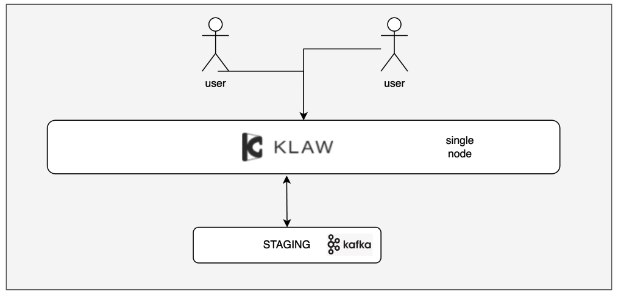
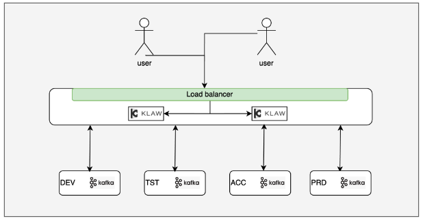
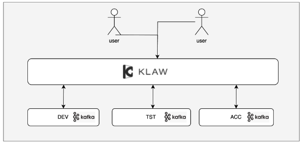
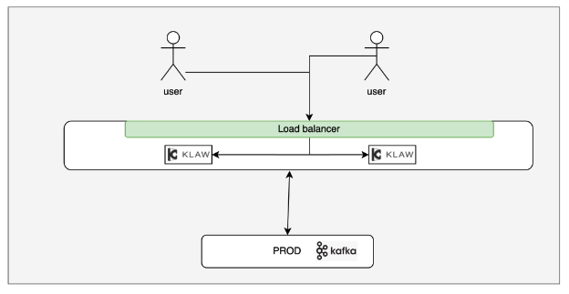

# Deploy Klaw

Learn how to deploy Klaw with an outline of steps and key points for a smooth update to the latest version in your organization.

## Klaw releases cycle

Our team and Klaw contributors are dedicated to consistently improving the features and performance of Klaw. We aim to roll out a new release approximately every 1.5 months. You can access all past and the most recent releases [here](../category/Releases). Highlighted updates include versions such as 2.4.0, 2.5.0, among others.

## Deployment strategy

Follow these recommended steps for deploying each new release:

- **Staging deployment**

  Begin by deploying the latest version of Klaw to a staging environment. Here, you should conduct thorough sanity tests to ensure all the functionalities critical to your organization are working as expected.

  

  Ensure to proceed to the next phase only after verifying that the staging evaluation meets your standards.

- **Production rollout**

  After successfully completing the staging phase, proceed to upgrade your production environment, ensuring you minimize disruptions and have rollback strategies in place if needed.

## Deployment scenarios

Your choice of deployment scenario will depend on your organization's specific processes and governance policies.

### Scenario 1: Environment promotion with Klaw

Klaw simplifies the process of promoting Apache Kafka topics, schemas, and connectors across different stages of your environment, making it straightforward to move from development to production. If this feature aligns with your operational requirements, begin by setting up Klaw and integrating it into your Apache Kafka ecosystems, as detailed in the illustration below.

### Scenario 2: Select environment promotion

If your process requires restricting promotions to specific environments, or you prefer managing your production Apache Kafka independently, follow these steps:

- Set up a Klaw instance to connect Development (Dev), Testing (Tst), and Acceptance (Acc) environments for controlled and sequential promotions.

  

- Use a dedicated Klaw instance exclusively for your Production (Prod) environment to ensure secure and independent management.

  
