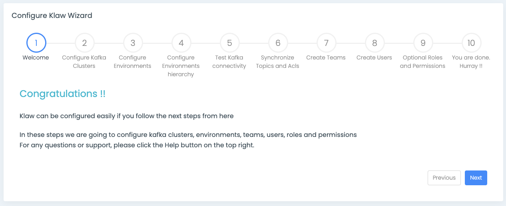
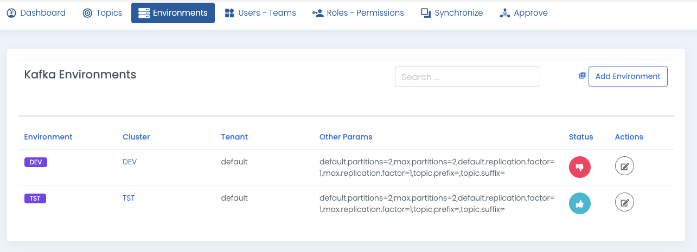
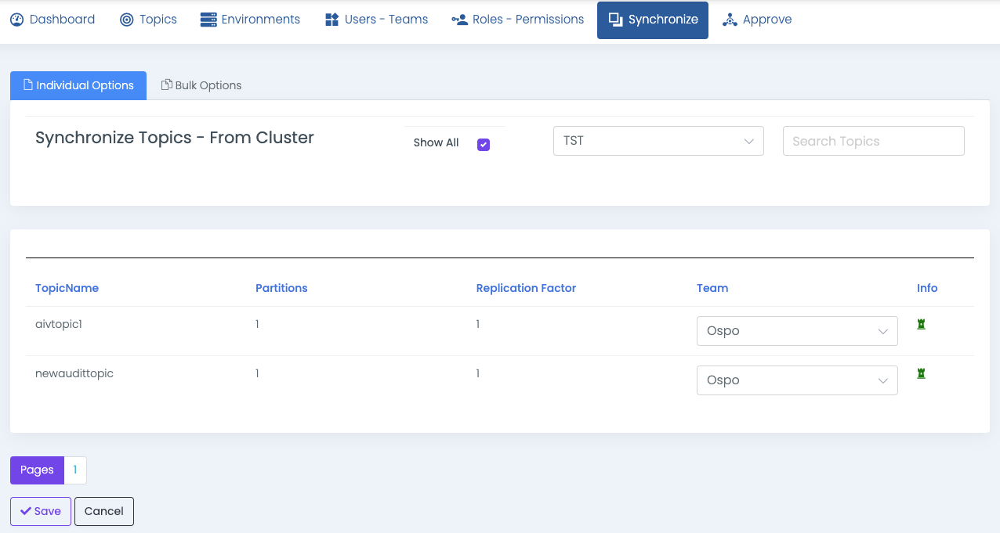

# Configure Klaw with Wizard

The first time you log in to Klaw as an administrator, you will see the
Klaw configuration wizard that guides you through the steps required to
configure the Klaw cluster.

:::note
For subsequent logins, you access the Klaw configuration wizard using
URL: [https://host:port/helpwizard]
:::



1. Configure Kafka clusters

   The first step is to configure your Kafka cluster. You can add any
   number of clusters. Only users with SUPERADMIN roles (or check allowed
   permission) can add clusters.

   After adding the cluster, based on the protocol selected (SSL or any
   other protocol), ensure the Klaw Cluster API's `application.properties`
   files include the relevant configurations.

   Example:

   ```java
   dev1.kafkassl.protocol=TLS
   dev1.kafkassl.key.pwd=trustme
   dev1.kafkassl.keystore.location=/srv/certs/client.keystore.p12
   dev1.kafkassl.keystore.pwd=trustme
   dev1.kafkassl.keystore.type=PKCS12
   dev1.kafkassl.truststore.location=/srv/certs/client.truststore.jks
   dev1.kafkassl.truststore.pwd=trustme
   dev1.kafkassl.truststore.type=JKS
   ```

2. Configure Environments

   Environments are wrappers over your Kafka clusters. You can add any
   number of environments and have multiple environments connected to one
   Kafka cluster with different settings. Only users with SUPERADMIN roles
   (or check allowed permission) can add environments by default.
   Additionally, you can configure the partitions, replication factors,
   topic prefixes, and suffixes for your Kafka topics under Kafka
   environments.

3. Test Kafka connectivity

   After configuring environments, you can test the connection by clicking
   the validate button.

   

4. Configure Tenant and Environment hierarchy

   Klaw is multi-tenant by default. Every tenant has its own set of Kafka
   environments, and users of one tenant cannot view/access topics, or ACLs
   from other tenants. To configure tenants, navigate to **Dashboard -\>
   Settings**, and look for [klaw.tenant.config].

   Example :

   ```json
   {
     "tenantModel": {
       "tenantName": "default",
       "baseSyncEnvironment": "DEV",
       "orderOfTopicPromotionEnvsList": ["DEV"],
       "requestTopicsEnvironmentsList": ["DEV"],
       "baseSyncKafkaConnectCluster": null,
       "orderOfConnectorsPromotionEnvsList": null,
       "requestConnectorsEnvironmentsList": null
     }
   }
   ```

5. Synchronize Topics and ACLs

   If you already have a Kafka cluster, you can easily migrate topics and
   ACLs to Klaw using the **Synchronize** option. As a SUPERADMIN, you can
   synchronize topics and ACLs by default. Navigate to **Synchronize** menu
   and select **Topics from cluster** or **ACLs from cluster** to
   synchronize the topics or ACLs. You also can synchronize topics
   individually or with a bulk option, assigning all at a time to one team.
   Users can synchronize topics from cluster to Klaw with `SYNC_TOPICS`
   permission.

   

6. Create Teams

   After adding clusters and environments, you can create **Teams**. A team
   owns topics and is also a collection of users. A user can manage teams
   with `ADD_EDIT_DELETE_TEAMS` permission.

7. Create Users

   **Users** can be created and assigned to the newly created teams. A user
   with `ADD_EDIT_DELETE_USERS` permission or the SUPERADMIN role can add
   users.

8. Create any other Roles and Permissions (Optional)

   A **role** is a collection of permissions defining the tasks a user can
   perform. Add roles and assign permissions to the added roles. A
   SUPERADMIN can add roles by default. Other users can add roles with
   `ADD_EDIT_DELETE_ROLES` permission.

You are all set now. Your team members can request topics or ACLs and
approve requests.
