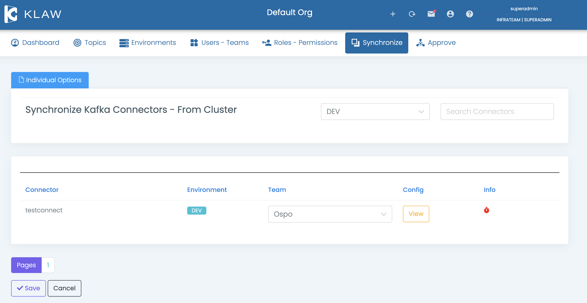

# Synchronize connectors from cluster

To synchronize connectors from an Apache Kafka® Connect cluster with
Klaw, follow the steps below. This process involves retrieving the
connectors from an existing Apache Kafka Connect cluster and assigning
them to a team in Klaw.

## Prerequisites

1. **Environment configuration**: Make sure to configure your environments and set the `klaw.tenant.config` property as
   described in the [tenant configuration](tenant-config.md) guide.
2. **User permissions**: You need to be logged in as a `SUPERADMIN` or a user with the `SYNC_CONNECTORS` permission.

## Steps to synchronize connectors

1. Navigate to the **Synchronize** menu and select **Connectors from Cluster**.

2. Synchronize connectors with the following option:

   - Select one or more connectors individually, choose a team, and
     save.
   - The selected connector will now appear in the **Apache Kafka
     Connect** menu, assigned to the chosen team.

   

<!-- vale off -->

In case a connector is deleted from the cluster but still exists in Klaw metadata, you can remove it by selecting **REMOVE FROM KLAW** at the end of the corresponding record.

<!-- vale on -->
