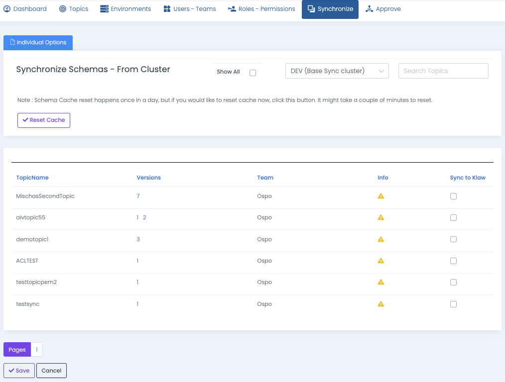

# Synchronize Schemas from cluster

To synchronize schemas from a Schema Registry server to Klaw, follow the
below procedure, which involves retrieving the topics and their schema
versions from an existing Schema registry cluster and saving them to the
topic.

As Topic Owners own schemas, this functionality allows you to
select topics with schemas and synchronize them with Klaw metadata.

:::note
A schema can have multiple versions. During synchronization, Klaw will delete and replace any existing schema and its versions associated with the selected topics with those available on the Schema Registry server.
:::

## Prerequisites

- **User Permissions**: Log in with a user account with either a `SUPERADMIN` or a user with the `SYNC_SCHEMAS` permission.

## Steps to synchronize schemas

1. Navigate to the **Synchronize** menu and select **Schemas from cluster**.
2. Synchronize schemas using following option:

   - `Individual Options`: Select one or more topics individually
     and save. The selected schemas will now appear in the
     **Schemas** tab in the **TopicOverview** menu.

   Klaw caches the schema information and automatically refreshes it once a
   day or whenever there are changes to the schemas. However, if someone
   manually adds or deletes a schema on the schema registry server, you can
   manually reset the cache using the **Reset Cache** button on the page.

   

   :::note
   The **Show All** option displays the topics and their associated schemas that have already synchronized with the Schema Registry cluster. These topics require no further action, as a green icon can identify them.
   :::

By following these steps, you can synchronize schemas from a Schema
Registry cluster to Klaw metadata.
