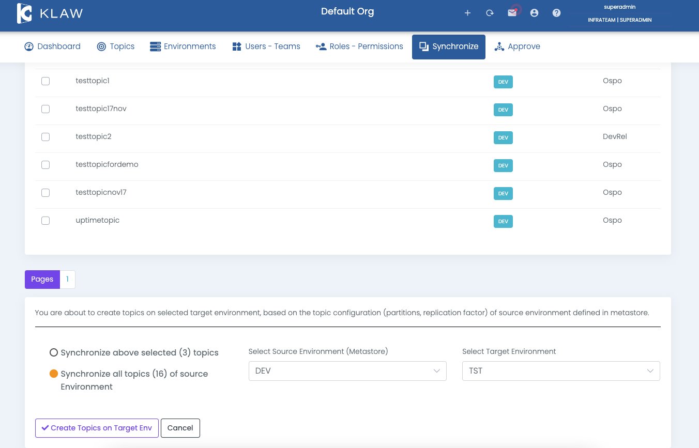

# Synchronize Topics to cluster

To synchronize topics from Klaw to an Apache Kafka cluster, follow the
below steps, which involve displaying the topics in Klaw and creating
them on the Apache Kafka cluster.

## Prerequisites

- **Configuration**: Make sure to configure the environments and the `klaw.tenant.config` property. Refer to the [Tenant Configuration](tenant-config) documentation for more information.
- **User Permissions**: Log in with a user account with either `SUPERADMIN` or as a user with the `SYNC_BACK_TOPICS` permission.

## Steps to synchronize topics

1. Navigate to the Synchronize menu and select **Topics to Cluster**.
2. To synchronize topics, select the source environment (Klaw metadata
   with topics) and target environment (Kafka cluster where topics have
   to be created).

   

If a topic already exists, you will see a `TopicAlreadyExistsException`,
which can be ignored, and you can proceed with the other topics.
