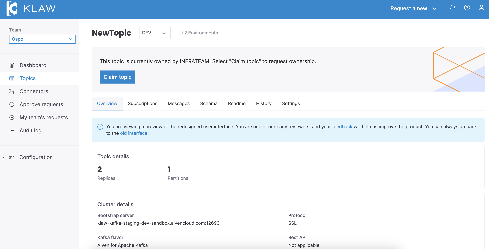

# Topic overview

When you choose a topic on Klaw, you will be directed to the **Topic overview** page, where you can find comprehensive information about the topic's settings, subscriptions, messages, and more, offering a holistic view to manage and understand your selected topic effectively.

## Overview tab

In this tab, you can view the topic's settings, connection details, subscriptions, and schemas overview.

* **Topic details**: In this section, you can view the settings related to the topic, such as partitions, replication factors, and any advanced configurations.
* **Cluster details**: This section provides key information about the cluster, such as the Bootstrap server address for connections, the protocol used, and the specific Kafka version. You can also see the cluster name, current status, and associated REST API details.
* **Subscriptions & schemas**: This section displays the total count of producers and consumers subscribed to the topic and the number of associated schemas. You can directly **Request new subscription** or **Request new schema** as needed. To view the current subscriptions and schemas, click the **See subscriptions** and **See schema** options. 

In this tab, the below are displayed

- topic configuration like partitions, replication factor and if any advanced configuration
- cluster details like bootstrap url
- count of producer and consumer subscriptions and schemas

## Subscriptions tab

Accessing this tab, you're presented with an overview of producers and consumers associated with the topic. Here's what you can do:

* **Request a new subscription**: Directly initiate the process to add a new subscription.
* **Filter subscriptions**: Use the dropdown menus to narrow down your view by team or ACL type.
* **Search**: If you're trying to find a specific principal or IP, use the search bar. It recognizes partial matches and starts searching as you type. To clear your search, press the "Escape" key.
* **Subscription types**: Use the tabs like "User subs.", "Prefixed subs.", and "Transactional subs." to see different types of subscriptions.

## Messages tab

This tab allows you to view messages or events associated with the topic. For this feature to be accessible, a consumer group needs to be configured in the Klaw Cluster API. Ensure it's set up using the

    klaw.topiccontents.consumergroup.id

## Schemas tab

Within this tab, you can explore all Avro schemas and their versions related to the topic. Additionally, you have the flexibility to request a new schema or promote an existing one.

## Readme tab

Readme provides essential information, guidelines, and explanations about the topic, helping team members understand its purpose and usage. Edit the readme to update the information as the topic evolves. You can write and format your notes easily as this tab supports markdown following the CommonMark standard. You can also search for specific information within your notes.

## History tab

In this tab, you can view a detailed audit of every topic request, promotion request, configuration update, and ACL request made for the topic. It provides a comprehensive record, ensuring complete visibility of all topic-related actions.

## Settings tab

If you're using the new React user interface, you can request to delete a topic in this tab. For Angular interface users, this option is available in the **Overview** tab.

For a visual summary of the **Topic overview**, check the image below.

