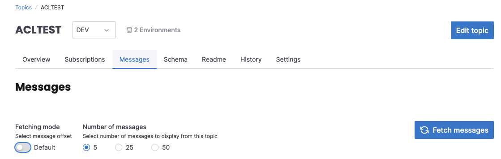
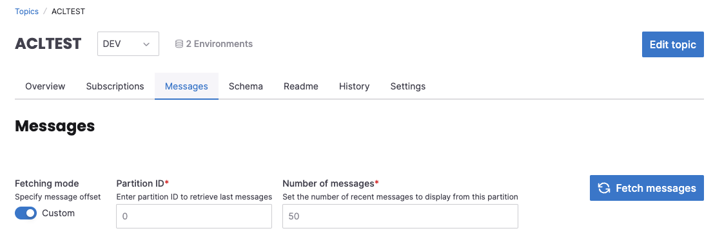

# View Topic Events

In Klaw, it is possible to view the actual events on a topic, provided they are un-encrypted.

## How to view Events

1. Select the topic for which you want to view the events. (Note you must belong to the topic owner team.)

2. Go to Topic Overview and select the right environment for the topic

3. In the bottom, in the new UI, you can select `Messages` tab ( in the old UI, select the `Topic Contents` tab )

4. Two types of fetching modes are available.

   In default mode, you can select a number of messages to be displayed. This will display the last messages from the partitions.

   

   In custom mode, you need to select a partition and number of messages. This will display the last messages from that partition.

   

   :::note
   Make sure the property `klaw.topiccontents.consumergroup.id` is enabled cluster-API application. You may change the value of the consumer group.
   However, an ACL has to be created to allow this consumer group to read the messages from Klaw host machine.
   :::

5. After the selection, messages will be displayed.
