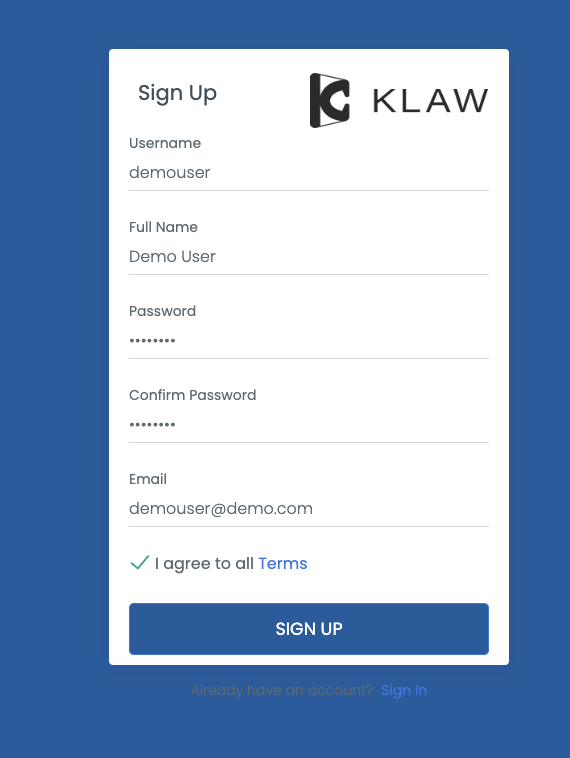

# Manage users

Klaw stores user information in its metadata, and the method of
[authentication](./authentication) may
vary depending on the configuration. Each user is associated with a team
and a role, and if the **Switch teams** flag is enabled, they can switch
between multiple teams.

## User signup

To sign up for a user account in Klaw, you can access the option on the
homepage.

To complete the sign-up process, follow these steps:

1. Fill out all the required fields.
2. Submit your information.
3. After submitting your information, a request will be created for the
   administrators to approve.
4. Once approved, you will be assigned to the **STAGING TEAM**, which
   can be changed later.

## Profile update

After logging in, you can update your profile information, including
your email address and name, from the **My Profile** menu.

## Change password

You can change your password from the **Change Password** menu.

## Update other users

Administrators who have been granted the `ADD_EDIT_DELETE_USERS`
permission can modify the attributes of other users, including their
team, role, name, email address, and ability to switch teams.
