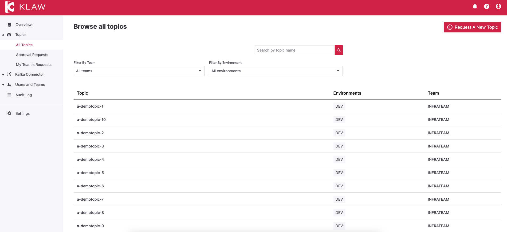
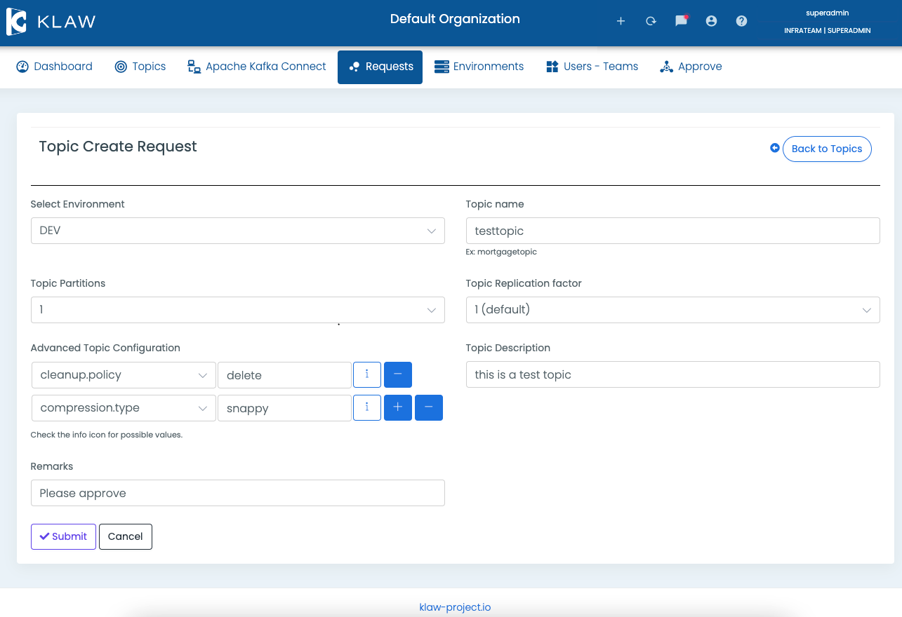

# Release 1.2.0

Date: 15th Dec, 2022

## Overview

Klaw version 1.2.0 is a minor release that includes a number of
improvements and new features designed to enhance the Klaw user
experience.

Some of the key features and enhancements in this release include the
introduction of React UI, a more user-friendly and intuitive interface
for browsing and working with topics in Klaw, support for Azure AD
authentication, enhancements to the codebase, and more.

## What's new in Klaw 1.2.0

### Introducing React for UI

React is a popular open-source JavaScript library that simplifies the
development of front-end applications and provides a great alternative
to large, complex front-end frameworks like AngularJS. Klaw's current
user interface is built with AngularJS, which is no longer officially
supported by Google. As an older framework, it does not leverage modern
or component-based development.

React, on the other hand, provides greater flexibility and modularity,
making it easier to design reusable components and scale an application.
Furthermore, React makes it easier to create consistent and cohesive
user experiences.

Moving to React for Klaw's UI provides numerous benefits in terms of
performance, scalability, ease of development, and support by a large
community of developers. We've tested React with our current interface,
and it looks amazing - we're excited to start this new journey.

### New look and feel for Browse topics

With the switch to React for UI, this release also introduces the
redesigned user interface for Browse topics, providing a more
user-friendly and intuitive interface for managing Kafka topics in Klaw.
It consists of changes to the layout, styling, and overall appearance of
the interface, as well as improvements to make browsing and working
topics easier, more efficient, and more accessible.

To preview the new Klaw user interface, open the
`application.properties` file on the Klaw **core** module, and set the
value of the following property to true:

    # Enable new Klaw user interface
    klaw.coral.enabled=true

Login to Klaw and under Topics, click the banner with the preview link.

Below is a screenshot of the redesigned UI



:::note
We are taking an incremental, feedback-driven approach in rolling out
the new Klaw interfaces. By providing the feature flag to preview user
interfaces, we would like you to share your valuable
[feedback](https://github.com/aiven/klaw/issues/new?assignees=&labels=&template=03_feature.md).
:::

### Support for Azure AD Authentication

Klaw now supports Azure Active Directory (Azure AD) authentication.
Azure AD is an identity and access management service provided by
Microsoft. It allows organizations to manage user access to applications
and resources securely. By using Azure AD authentication, organizations
can leverage their existing Azure AD infrastructure to manage access to
Klaw.

To enable Azure AD authentication for a Klaw user, configure the
`spring.cloud. Azure.active-directory.*` properties in the
`application.properties` file on the Klaw **core** module with the Azure
AD properties. This configuration allows Klaw to integrate with Azure AD
authentication enabling users to log in to Klaw using their Azure AD
credentials.

A sample configuration of Azure AD based authentication for Klaw is as
shown below:

```java
klaw.sso.server.loginurl=/oauth2/authorization/azure
spring.cloud.azure.active-directory.enabled=true
spring.cloud.azure.active-directory.profile.tenant-id=tenantid
spring.cloud.azure.active-directory.credential.client-id=clientid
spring.cloud.azure.active-directory.credential.client-secret=client-secret
```

### Advanced configurations for topics

The **Request new topic** function in Klaw now includes an advanced
topic configuration section, where you can configure all the supported
[topic-level
configurations](https://kafka.apache.org/documentation/#topicconfigs)
available in Kafka.

From the advanced topic configuration section, you can specify
additional configuration options for Kafka topics, such as the cleanup
policy, retention period, flush interval, and more.



:::note
For a complete list of improvements, changelog, and to download the
release, see <https://github.com/aiven/klaw/releases/tag/v1.2.0>
