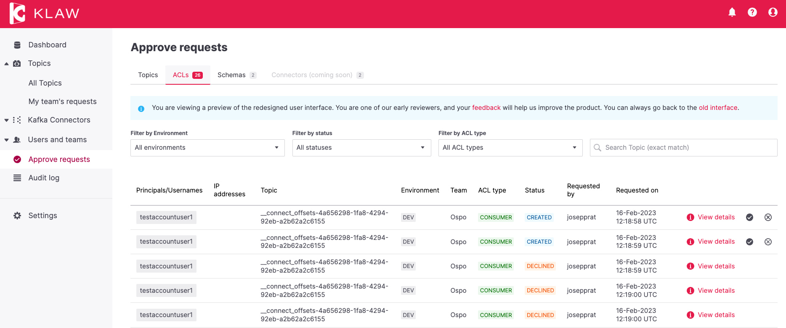

# Release 2.1.0

Date: 3rd of March, 2023

## Overview

Klaw version 2.1.0 is a minor release with several new features and
improvements. Key highlights of this release include redesigned approval
and decline screens in the React UI, Confluent Cloud support, The
ability to switch between teams, codebase optimizations, and additional
enhancements.

## What's new in Klaw 2.1.0

### Redesigned Request screens with React UI

With the switch to React, this release features a redesign of the
following user interfaces:

- **Approve and Reject Topic Requests**: Users can now approve or
  reject topic requests using the new UI.
- **Approve and Reject Subscription Requests** (Producer/Consumer):
  Users can now approve or reject ACL requests for both producers and
  consumers using the new UI.
- **Approve and Reject Schema Requests**: Users can now approve or
  reject schema requests using the new UI.

To preview the new Klaw user interface, open the
`application.properties` file on the Klaw **core** module, and set the
value of the following property to `true`:

    # Enable new Klaw user interface
    klaw.coral.enabled=true

:::note
We are taking an incremental, feedback-driven approach in rolling out
the new Klaw interfaces. By providing the feature flag to preview user
interfaces, we would like you to share your valuable
[feedback](https://github.com/aiven/klaw/issues/new?assignees=&labels=&template=03_feature.md).
:::

### Confluent Cloud Apache Kafka

Klaw now offers Confluent Cloud Apache Kafka Topics and ACLs support, expanding
its capabilities to interact with Confluent Cloud Apache Kafka. This release
includes the implementation of the following APIs:

- [Topic
  (v3)](<https://docs.confluent.io/cloud/current/api.html#tag/Topic-(v3)>)
- [ACL
  (v3)](<https://docs.confluent.io/cloud/current/api.html#tag/ACL-(v3)>)

For more information, see [Confluent
Cloud](../../docs/HowTo/clusterconnectivity/confluent-cloud-kafka-cluster-ssl-protocol.md).

### Switch Teams

Klaw now allows users to be members of multiple teams and easily switch
between them without needing to log out and back in. With this new
functionality, a single user can now have proper auditable capabilities
while working across multiple teams. Additionally, users will benefit
from increased flexibility and efficiency when working within the Klaw
platform, particularly when creating or approving requests.

For more information, see [Switch
Teams](../../docs/Concepts/switch-teams.md).

:::note
For a complete list of improvements, changelog, and to download the
release, see <https://github.com/aiven/klaw/releases/tag/v2.1.0>
