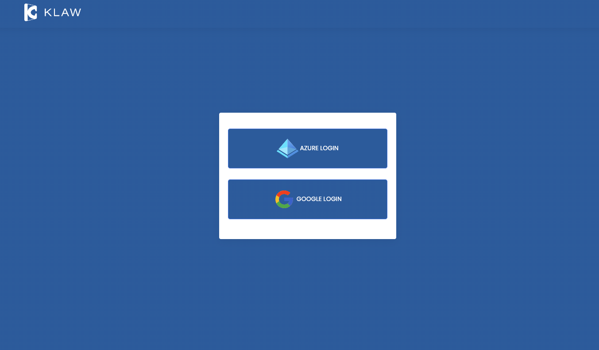
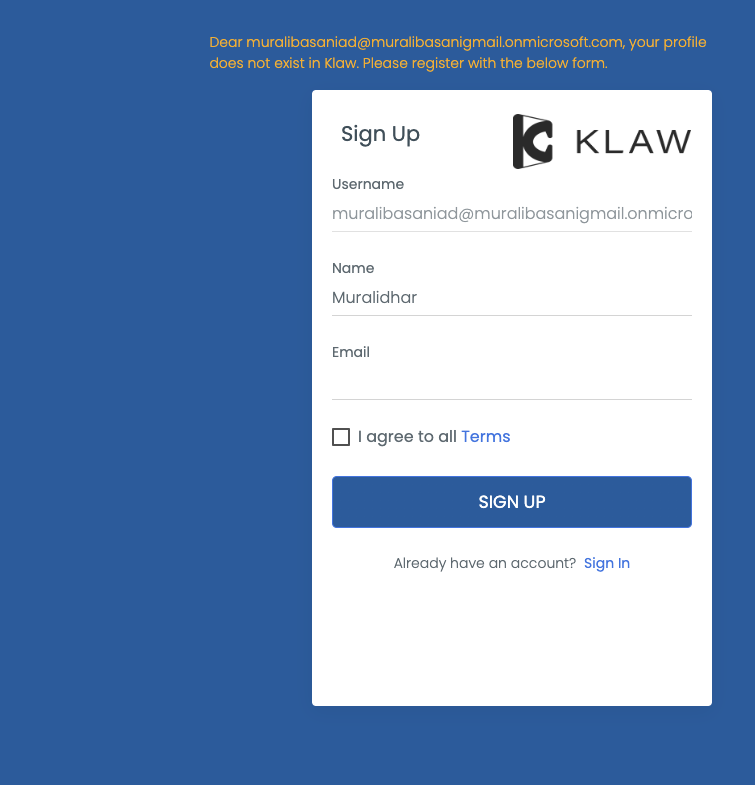

# Login with third-party accounts

You have the option to configure any third-party login account to access
Klaw.

To enable third-party login accounts, you need to make the following
configurations in the `application.properties` file in the Klaw Core
module.

1. Make sure Klaw is running in a secure mode. You will find the following configuration:

   `server.ssl.key-store.*`

2. Configure the authentication type by setting the value to `ad` in the following property: :

   `klaw.login.authentication.type=ad`

3. Enable SSO by setting the value to [true] in the following property

   `klaw.enable.sso=true`

4. To enable third-party account-based authentication, find the registration of the third-party account like GitHub or
   Twitter and replace `registrationid` with the third-party account ID in the following properties. Additionally,
   provide the appropriate values for ClientId, Client secret, and Tenant Id

   ```java
   # Uncomment the below OAuth2 configuration to enable Google based authentication
   #spring.security.oauth2.client.registration.registrationid.client-id=
   #spring.security.oauth2.client.registration.registrationid.client-secret=
   #spring.security.oauth2.client.registration.registrationid.redirect-uri=https://localhost:9097/login/oauth2/code/google
   #spring.security.oauth2.client.registration.registrationid.scope=profile, email
   #klaw.sso.server.loginurl.registrationid=/oauth2/authorization/registrationid
   ```

5. Configure an existing SUPERADMIN user from AD to approve new users in the following property for username: :

   `klaw.superadmin.default.username=superadmin@company.com`

6. To add a logo of the third-party provider to the login button, you can update the `application.properties` file with
   the following entry:

   `spring.security.oauth2.client.registration.{provider}.imageURI=assets/images/clients/logo.svg`

   where `{provider}` is the name of the third-party provider, such as GitHub or Okta.

   The `imageURI` property specifies the URL of the logo image. The image must be uploaded to
   the `assets/images/clients` folder before you can use this property.

7. Each SSO provider can have a different "preferred username" attribute which identifies your user correctly.
   Check your providers documentation and select the attribute which defines the email address.
   update this attribute in the application.properties replacing 'preferred_username' with their attribute.

   `klaw.ad.username.attribute=preferred_username`

8. If you have already signed up, you will be directed to the Klaw home
   page.

   

   Enter the credentials for the third-party account.

   :::note
   Login page for third-party account is not fully updated.
   :::

9. If this is your first time logging in, you will be presented with a
   signup form to fill in. On submission, a request will be created for
   the Klaw Administrator to approve or decline.

   
