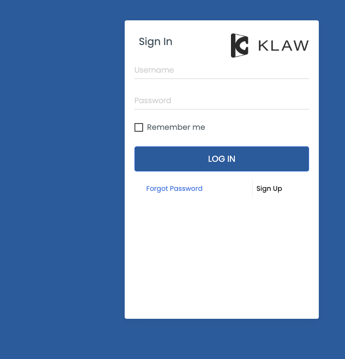

# Login with Windows Active Directory

You can log in to Klaw using the Windows credentials configured in the Windows Active Directory.

Before you can proceed with using your Windows Active Directory credentials, you need to make the following
configurations in the `application.properties` file in the Klaw Core module.

1. Configure the authentication type by setting the value to `ad` in the following property:

   `klaw.login.authentication.type=ad`

2. To enable active directory-based authentication, uncomment the following properties and provide the appropriate
   values for your Active Directory configuration:

   ```java
   # Uncomment the below ActiveDirectory properties for users to login with their active directory credentials.
   #spring.ad.domain=
   #spring.ad.url=
   #spring.ad.rootDn=
   #spring.ad.filter=
   ```

3. Configure an existing SUPERADMIN user from AD (which already exists) to approve new users
   in the following property for username:

   `klaw.superadmin.default.username=superadmin@company.com`

4. Each SSO provider can have a different "preferred username" attribute which identifies your user correctly.
   For Windows the default value should suffice, however if it has been changed
   update this attribute in the application.properties as below.

   `klaw.ad.username.attribute=preferred_username`

5. If you have already signed up, you will be directed to the Klaw home
   page.

   

6. If this is your first time logging in, you will be presented with a
   signup form to fill in. On submission, a request will be created for
   the Klaw Administrator to approve or decline.

   
