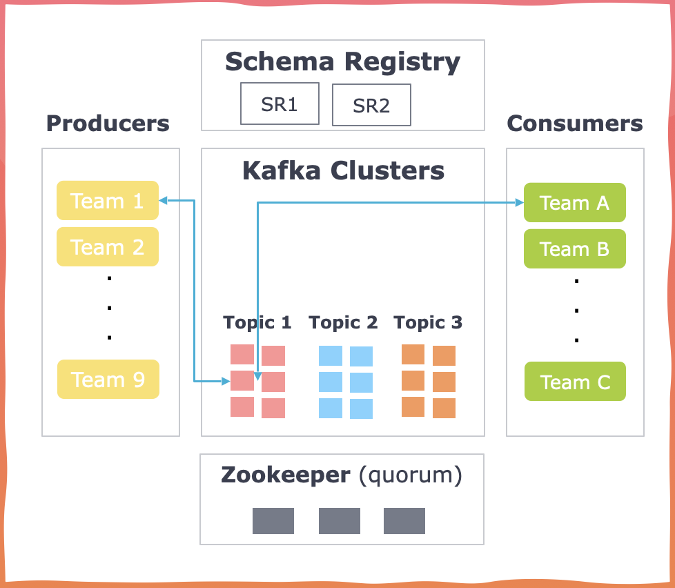
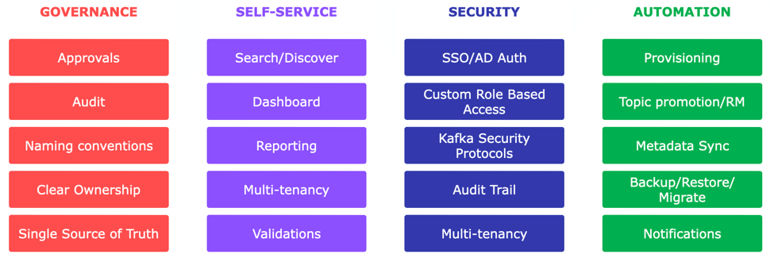

Making Kafka Governance a Breeze for Developers
===============================================

.. post:: May 15, 2023
   :tags: kafka,governance,topics,acls,klaw
   :category: kafka
   :author: Murali Basani

Background
----------
In today's ever-evolving technological landscape, organizations worldwide have Apache Kafka for its unparalleled scalability and exceptional features, leading to a paradigm shift in how messaging systems are handled. As more and more organizations adopt Kafka as a vital component of their technology stacks, the need for effective Kafka governance becomes paramount.

.. code-block:: bash

    A common challenge companies face is the inability to effectively govern and manage access permissions for the numerous topics created, often numbering in the hundreds or even thousands.

Managing Kafka topics poses significant challenges for companies, often leading to struggles executing the task effectively. Several crucial considerations arise when undertaking this endeavor:

* **Authorization and ownership**: Determining who has the rights to produce and consume messages on a specific topic and establishing clear ownership are crucial aspects to address.
* **Configuration backup and restoration**: Establishing robust strategies for backing up and restoring Kafka's configuration is essential to ensure prompt recovery in the face of failures or system disruptions.
* **Security measures**: Ensuring the proper enforcement of security measures through subscriptions and access controls is paramount to safeguarding sensitive data and preventing unauthorized access.
* **Topic promotion**: Navigating the process of smoothly promoting topics with thoroughly tested configurations from lower environments to production requires careful planning and coordination.
* **Enhancing visibility and awareness**: Increasing the visibility and awareness of topics within the organization facilitates better collaboration and knowledge sharing among teams.

Managing a small number of Kafka topics may seem manageable at first. However, as Kafka usage grows and more applications and teams are added, effective and efficient management can become increasingly challenging. This includes the important task of isolating sensitive topics containing GDPR, HIPAA, or other types of sensitive data. It is essential to ensure that only authorized applications can access these topics to maintain data security and regulatory compliance.

Typical challenges
------------------

The current system faces several challenges that impede efficiency and effectiveness, posing risks and hindering productivity. Identifying and addressing these typical challenges can enhance operations and optimize overall performance. 

Let's explore the fundamental challenges that need to be tackled: 

- **Manual activities**
    Creating, accessing, and promoting a topic to a higher environment requires extensive email communication, involving approximately 10 emails. This manual approach consumes valuable time and increases potential errors and miscommunication.
- **Longer lead time**
    EThe end-to-end communication and execution of the manual activities take approximately 2.5 hours, excluding the time spent waiting for human responses. This long lead time hampers efficiency and slows down the overall workflow.
- **Security**
    The system faces Role-Based Access Control (RBAC) and data security-related challenges. Ensuring proper access rights and safeguarding sensitive information is crucial for maintaining the integrity and confidentiality of the system.
- **Lack of audit**
    No proper auditing mechanism is in place to track and monitor requests. This lack of audit trails creates an accountability gap, making identifying and rectifying potential issues or discrepancies challenging.
- **Adhoc governance**
    The absence of a centralized governance setup adds complexity to the system. All actions are initiated through emails, and the request approver list is maintained in spreadsheets or confluence. 
- **Release management**
    The manual release processes, mainly promoting configurations from one environment to another, introduce a significant risk of errors. These errors can cause system outages, leading to disruptions in service and impacting user experience.

Navigating Kafka system failures
~~~~~~~~~~~~~~~~~~~~~~~~~~~~~~~~~

Inevitably, failures occur across all systems, and Kafka applications are no exception. These failures can occur at the client level, such as when event deserialization results in issues for consumers or at the infrastructure level, leading to the loss of zookeeper/Kafka configurations.

Focusing on infrastructure issues, let's consider a scenario with 1000 topics, each possessing a unique configuration stored in a zookeeper. During disaster recovery, suppose the zookeeper crashes and fails to recover. The key question becomes: how swiftly can you retrieve the information and reboot your server? It's not just about having ways to store information but also about the strategic implementation of information storage and retrieval.

How to mitigate these problems?
~~~~~~~~~~~~~~~~~~~~~~~~~~~~~~~~``

To ensure a fail-safe Kafka system, it is crucial to mitigate these challenges by implementing a robust governance platform. This platform should encompass the following essential capabilities:

- **Comprehensive visibility**: Providing a holistic view of topics, producers, consumers, schemas, and connectors.
- **Secure configuration management**: Implementing a four-eye principle-based system for reviews and approvals to maintain the safety and consistency of configurations.
- **Notifications**: Alerting users about changes to schemas and other configurations.
- **Action tracking**: Maintaining a detailed record of actions performed by different users for transparent accountability.

Klaw
----
Klaw is a comprehensive toolkit designed to address the challenges Kafka developers encounter. It provides solutions for compliance and audit concerns, data security, and release management.

Developed as an open tool, Klaw is committed to contributing to the streaming community by empowering developers to leverage modern governance, control, and security practices while building Kafka applications. 

Klaw features
~~~~~~~~~~~~~~~~

Klaw is built upon four essential pillars, which serve as the foundation for its capabilities. 

``Governance`` - ``Self-service`` - ``Security`` - ``Automation``

- **Governance**: Ensures accountability and consistency with approvals, audit trails, naming conventions, clear ownership, and a single source of truth.
- **Self-service**: Empowers developers with search, customizable dashboard, reporting, and multi-tenancy for efficient resource management and data integrity.
- **Robust security**: Offers SSO/AD authentication, RBAC, Kafka Security protocols, audit trails, and multi-tenancy to address diverse security needs.
- **Automation**: Streamlines tasks like resource provisioning, topic promotion, metadata sync, backup/restore, and notifications for time and cost savings.

Benefits of Klaw
~~~~~~~~~~~~~~~~~

- Reduced Dependency: By reducing dependency on infrastructure teams and empowering developer teams, Klaw enables faster execution and decision-making, saving time, cost, and effort.
- Zero Risk of Manual Errors: With full self-service capabilities, Klaw eliminates the risk of manual errors, ensuring data accuracy and cost savings.
- Continuous Integration: Klaw enables continuous integration by seamlessly promoting topics and schemas to higher environments, ensuring consistency throughout the development pipeline.
- Secure Authentication: Klaw authenticates users based on an organization's single sign-on (SSO) or Active Directory (AD), providing a secure access control mechanism.
- Tailored Security Features: Klaw offers robust security features that cater to the specific needs of different types of organizations, ensuring data protection and compliance.

Klaw project resources
~~~~~~~~~~~~~~~~~~~~~~~~

Project GitHub repository : https://github.com/aiven/klaw

Git issues : https://github.com/aiven/klaw/issues

Contribute : https://github.com/aiven/klaw/blob/main/CONTRIBUTING.md

Documentation : https://www.klaw-project.io/docs

Conclusion
----------

Organizations are devising unique strategies to tackle the growing complexity of managing an increasing number of Kafka topics, schemas, and associated issues. These strategies involve using tools like Excel, Confluence, and GitOps for partial data maintenance. 

For a comprehensive and streamlined solution that simplifies the tasks for both developers and admins, Klaw stands as a highly effective one-stop solution.

.. code-block:: bash

    It's free and opensource.
