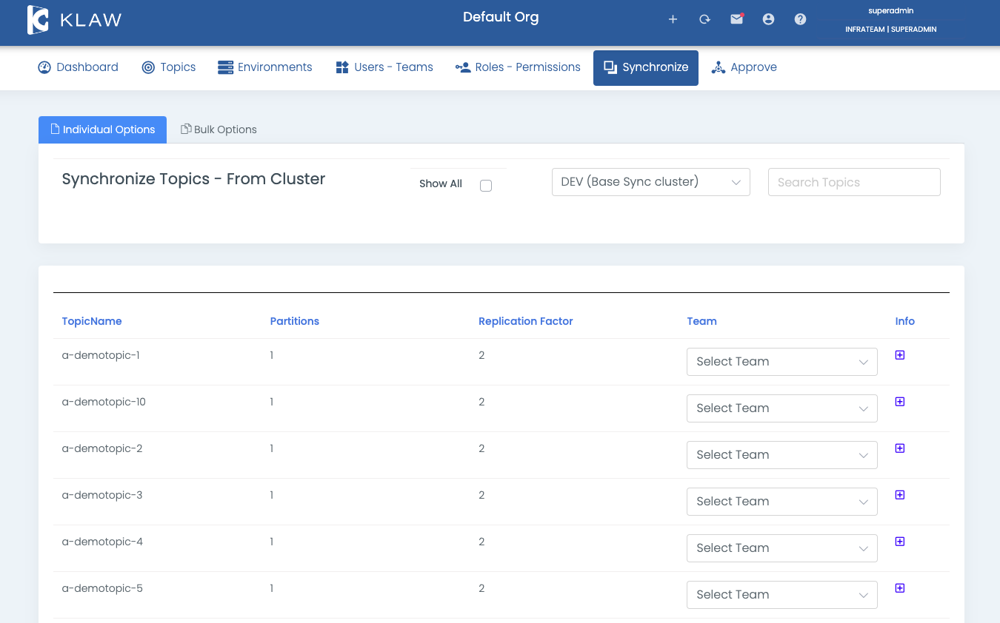

# Synchronize topics from cluster

To synchronize topics from an Apache Kafka® cluster with Klaw, follow the procedure below, which involves retrieving the
topics from an existing Apache Kafka cluster and assigning them to a Klaw team.

## Prerequisites

- **Configuration**: Ensure that your environments and the `klaw.tenant.config` property are configured as specified in
  the [Tenant Configuration](../../setup-configuration/tenant-configuration.md) documentation.
- **User Permissions**: Log in as either a `SUPERADMIN` or as a user with the `SYNC_TOPICS` permission.

## Steps to synchronize topics

1. Navigate to the Synchronize menu and select **Topics from Cluster**.

2. Synchronize topics with either of the following two options:

   - `Individual Options`: Select one or more topics
     individually, choose a team, and save. The selected topics
     will now appear in the **Topics** menu, assigned to the chosen
     team.
   - `Bulk Options` tab: Select all topics from the
     Apache Kafka cluster at once, choose a team and save. The selected
     topics will now appear in the **Topics** menu, assigned to the
     chosen team.

     

3. You can view all the topics and assign topics to a different team by
   selecting the **Show All** option. This displays all the Apache
   Kafka topics, both assigned and unassigned to any team.

If a topic is deleted on the cluster but still exists in Klaw metadata,
you can remove it from Klaw. You will notice this at the end of the
record.

By following these steps, you can synchronize topics from an Apache Kafka
cluster with Klaw metadata.

:::note
To get automated notifications whenever there are changes on topics between Klaw and Kafka clusters, configure the property
`klaw.notify.admins.clusterchanges.scheduler.enable` to `true` in Klaw Core module. This by default sends a notification
to Klaw admins at 12 AM everyday. If you would like to change that, you may configure the property for cron expression
`klaw.notify.admins.clusterchanges.scheduler.cron.expression`
:::
