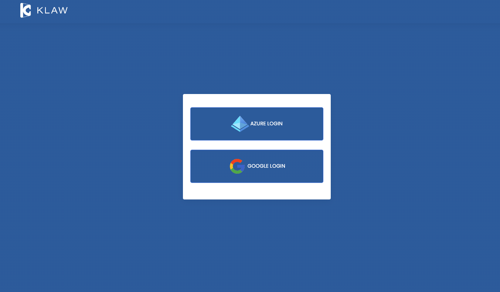
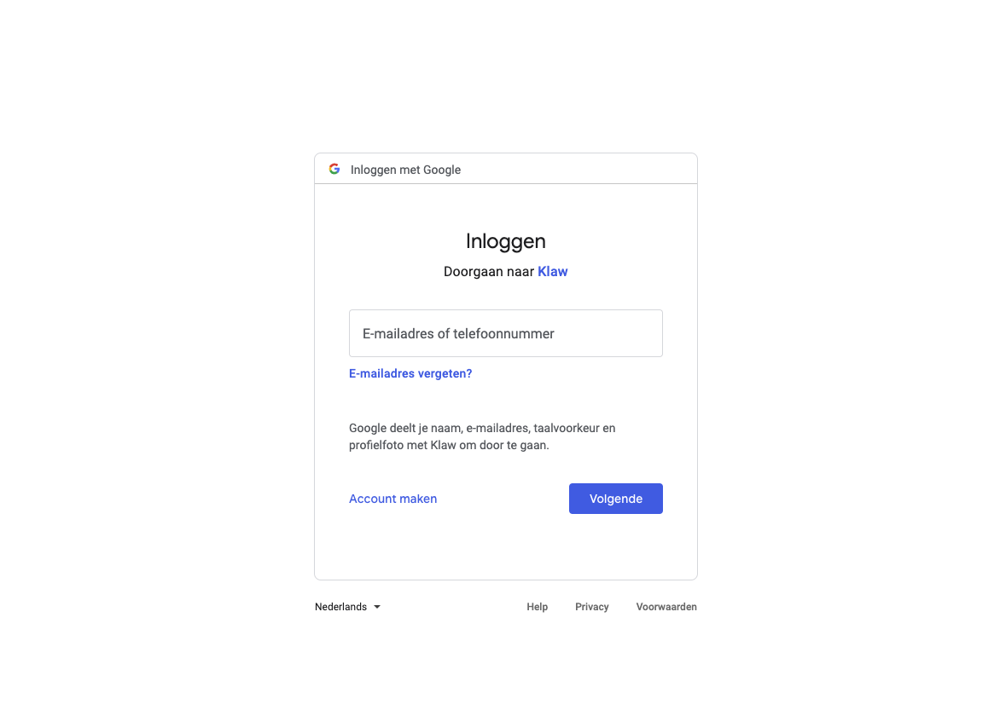
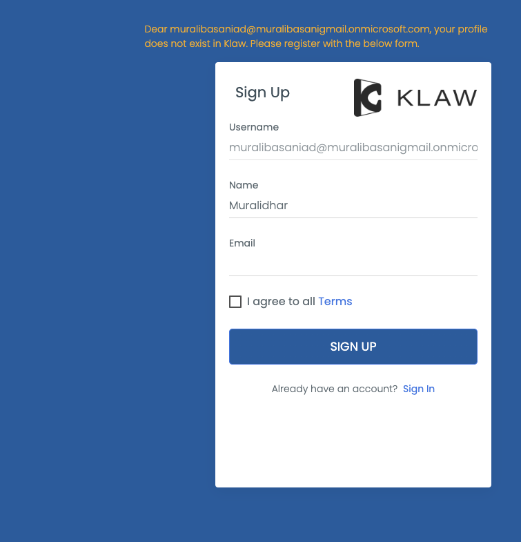

# Login with Google account

You can log in to Klaw using your Google account credentials. On the
login screen, you'll see an option to log in with a Google account.
Click the login button, and a pop-up window will appear, allowing you to
enter your credentials or select an Azure account.

Before using Google account credentials to log in to Klaw, you need to
make the following configurations in the `application.properties` file
in the Klaw-core module to enable the use of Google account login.

1. Make sure Klaw is running in a secure mode. You will find the
following configuration: :: server.ssl.key-store.\*

2. Configure the authentication type by setting the value to \"ad\" in
the following property: :: klaw.login.authentication.type=ad

3. Enable SSO by setting the value to [true] in the
following property: :

    klaw.enable.sso=true

4. To enable Google account authentication, uncomment the following
properties and provide the appropriate values for ClientId, Client
secret, and Tenant Id: :

    # Uncomment the below OAuth2 configuration to enable Google based authentication
    #spring.security.oauth2.client.registration.google.client-id=
    #spring.security.oauth2.client.registration.google.client-secret=
    #spring.security.oauth2.client.registration.google.redirect-uri=https://localhost:9097/login/oauth2/code/google
    #spring.security.oauth2.client.registration.google.scope=profile, email

5. Configure an existing SUPERADMIN user from AD to approve new users in the following property for username:

    <klaw.superadmin.default.username=superadmin@company.com>

6.  If you have already signed up, you will be directed to the Klaw home
    page.

    

    Enter your credentials in the Google login window.

    

7.  If this is your first time logging in, you will be presented with a
    signup form to fill in. On submission, a request will be created for
    the Klaw Administrator to approve or decline.

    
