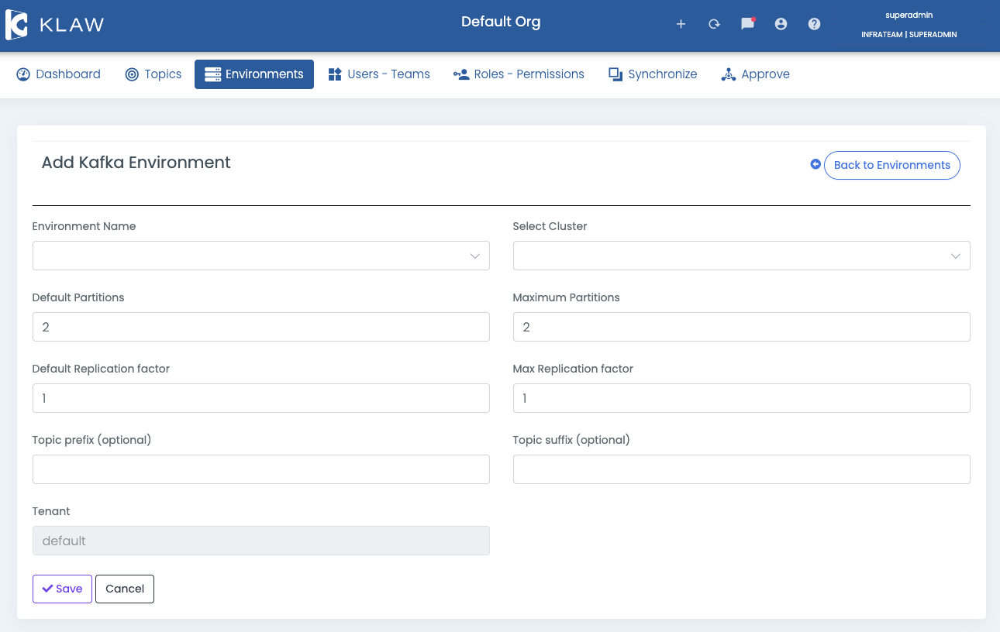
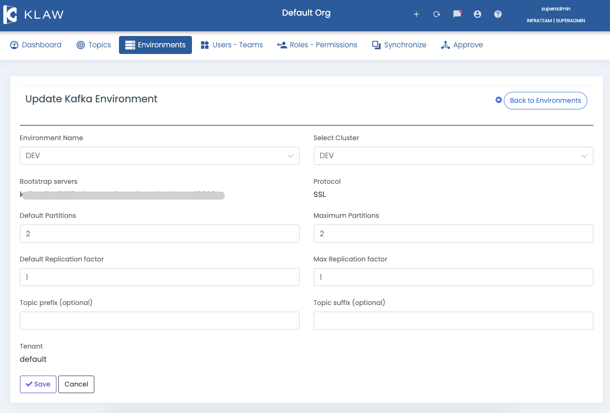
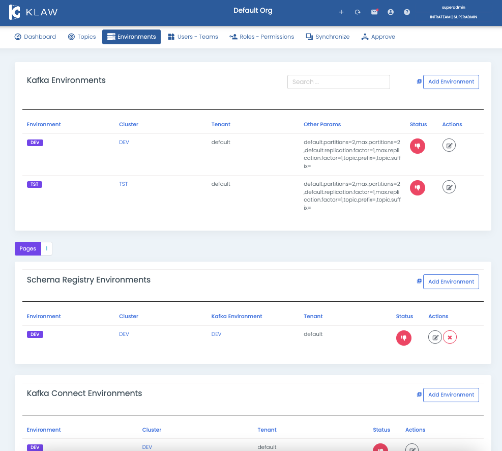

# Manage environments

Environments in Klaw are similar to application environments that act as
a wrapper over clusters. Each environment in Klaw is associated with a
cluster and there are three types of environments available:

-   Kafka
-   Schema Registry
-   Kafka Connect

## Prerequisite

To manage environments in Klaw, including adding, deleting, or updating,
you need to log in using a SUPERADMIN account or an account with the
`ADD_EDIT_DELETE_ENVS` permission.

## Add new environment

To add a new environment in Klaw, follow these steps:

1.  Log in to Klaw.
2.  Navigate to the **Environments** tab and select **Environments**.
3.  Select **Add Environment**.
4.  Select Add Environment for the type of environment you want to add.
    
### Add Kafka environment

To add a **Kafka environment**, enter the following details in the **Add Kafka Environment** screen:

-   **Environment name**: Choose an environment from the
    available dropdown list.
-   **Select cluster**: Choose the Kafka cluster you want to
    associate with this environment from the dropdown list.
-   **Default partitions**: Set the default number of
    partitions new topics should have in this environment.
-   **Maximum partitions**: Set the maximum number of
    partitions that a topic can have in this environment.
-   **Default replication factor**: Set the default
    replication factor for new topics in this environment.
-   **Max replication factor**: Set the maximum replication
    factor for topics in this environment.
-   **Topic prefix** (optional): If you want to add a prefix
    to your topics' names, enter it here.
-   **Topic suffix** (optional): If you want to add a suffix
    to your topics' names, enter it here.
-   **Tenant**: Set to default.

Select **Save** to add a new Kafka environment.

### Add Schema Registry environment

To add a **Schema Registry environment**, enter the following details in the **Add Schema Registry Environment** screen:

-   **Environment name**: Choose an environment from the
            available dropdown list.
-   **Select cluster**: Choose the Kafka cluster you want to
            associate with this environment from the dropdown list.
-   **Tenant**: Set the tenant to default.
-   **Select Associated Kafka Environment**: Choose a schema
            environment from the dropdown list.

Select **Save** to add a Schema Registry environment.

### Add Kafka Connect environment 

To add a **KafkaConnect environment**, enter the following details in the **Add KafkaConnect Environment** screen:

-   **Environment name**: Choose an environment from the
    available dropdown list.
-   **Select cluster**: Choose the Kafka cluster you want to
    associate with this environment from the dropdown list.
-   **Tenant**: Set the tenant to default.

-   Select **Save** to add a new KafkaConnect environment.

## Update environment

To update/modify an existing environment in Klaw, follow these steps:

1.  Log in to Klaw.
2.  Navigate to the **Environments** tab and select **Environments**.
3.  Choose the environment you want to update and Select on the
    **Edit/Modify** icon located in the **Actions** column.
4.  Update the relevant details.
5.  Select **Save** to apply your changes.
   
    :::note
    To modify the **Bootstrap servers** and **Protocol** details, you must
    edit them in the corresponding clusters.
    :::

## Delete environment

To delete an existing environment in Klaw, follow these steps:

1.  Log in to Klaw.
2.  Navigate to the **Environments** tab and select **Environments**.
3.  Select the **delete** icon next to the environment you want to
    remove.
4.  On the Confirmation screen, select **delete** to confirm the
    deletion of the environment. Once confirmed, the selected
    environment will be deleted.

