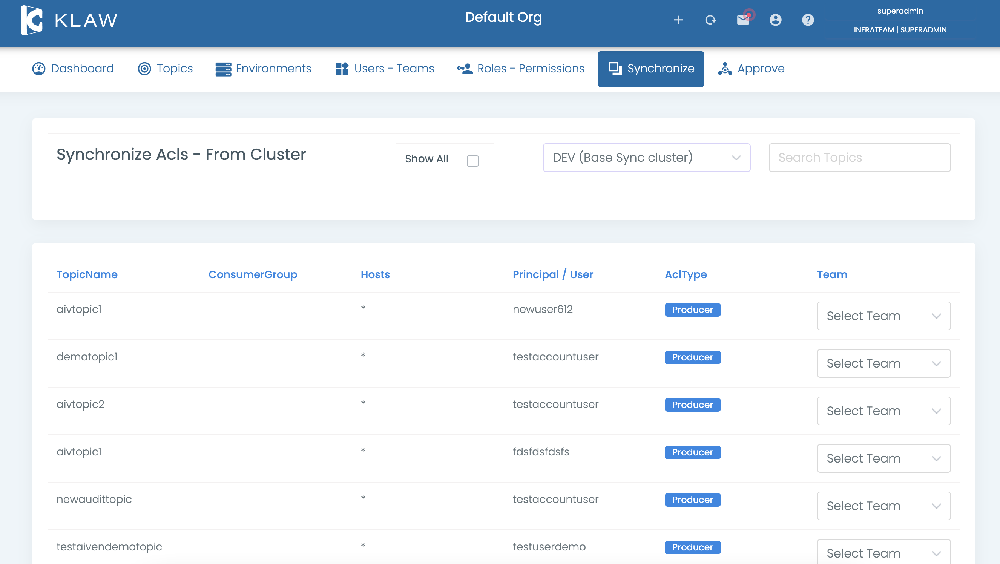

# Synchronize ACLs from cluster

To synchronize ACLs from an Apache Kafka cluster with Klaw metadata, use
this procedure, which entails retrieving the Acls (Producers &
Consumers) from an existing Kafka cluster and assigning them to a team
in Klaw.

1.  Configure Environments and the `klaw.tenant.config` property is configured as described in the [tenant-config](tenant-config) documentation.
2.  Log in as a SUPERADMIN or user with the `SYNC_SUBSCRIPTIONS`
    permission.
3.  Navigate to the **Synchronize** menu and select **ACLs from
    Cluster**.
4.  Select one or more ACLs, choose a team, and save. The selected ACLs
    will now appear in the topic overview page, assigned to the chosen
    team.

    

5.  You can view all existing ACLs and reassign them to different teams
    by selecting the **Show All** option. This will display all Kafka
    ACLs, both assigned and unassigned to any teams.

Following the above steps, you can synchronize ACLs from an Apache Kafka
cluster with Klaw metadata.
