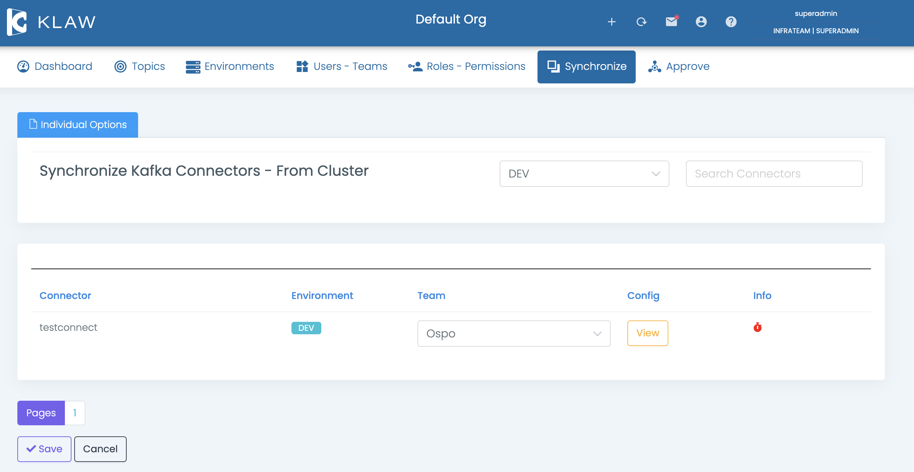

# Synchronize connectors from cluster

To synchronize connectors from an Apache Kafka Connect cluster with
Klaw, follow the steps below. This process involves retrieving the
connectors from an existing Apache Kafka Connect cluster and assigning
them to a team in Klaw.

1.  Configure the environments and the `klaw.tenant.config` property as
    specified in the `tenant-config`
    documentation.

2.  Log in as a **SUPERADMIN** or user with the `SYNC_CONNECTORS`
    permission.

3.  Navigate to the Synchronize menu and select **Connectors from
    Cluster**.

4.  Synchronize connectors with following option:

    > -   Select one or more connectors individually, choose a team, and
    >     save.
    > -   The selected connector will now appear in the **Apache Kafka
    >     Connect** menu, assigned to the chosen team.

In case a connector is deleted from the cluster but still exists in Klaw
metadata, you can remove it by selecting **REMOVE FROM KLAW** at the end
of the corresponding record.
