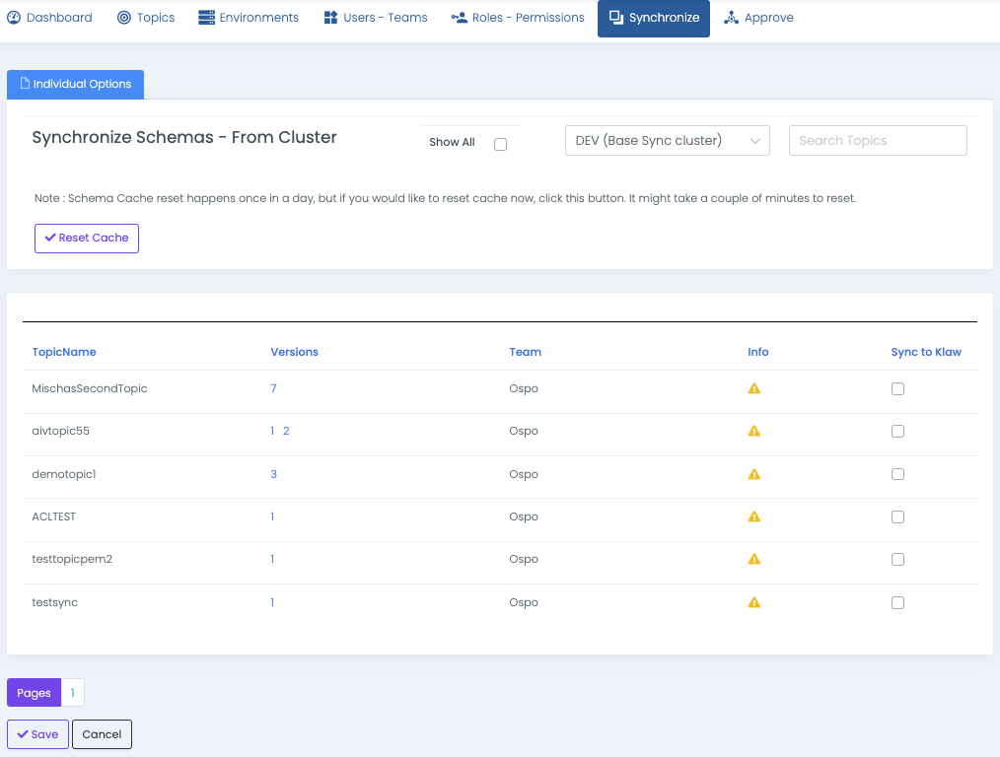

# Synchronize Schemas from cluster

To synchronize schemas from a Schema Registry server to Klaw, follow the
below procedure, which involves retrieving the topics and their schema
versions from an existing Schema registry cluster and saving them to the
topic.

As schemas are owned by Topic Owners, this functionality allows you to
select topics with schemas and synchronize them with Klaw metadata.

>A schema can have multiple versions. During this process, any existing
    schema (including all versions) in Klaw for the selected topic will be
    deleted and replaced with the schema (including all versions) available
    in the Schema Registry server.

1.  Log in as a SUPERADMIN or user with the `SYNC_SCHEMAS` permission.
2.  Navigate to the Synchronize menu and select **Schemas from
    cluster**.
3.  Synchronize schemas with the following option:
    -   `Individual Options` Select one or more topics individually
        and save. The selected schemas will now appear in the
        **Schemas** tab in the **TopicOverview** menu.

    Klaw caches the schema information and automatically refreshes it once a
    day or whenever there are changes to the schemas. However, if someone
    manually adds or deletes a schema on the schema registry server, you can
    manually reset the cache using the **Reset Cache** button on the page.
    
    

    > The **Show All** option displays the topics and their associated schemas that have already synchronized with the Schema Registry cluster. These topics require no further action as they can be identified by a green icon.

By following these steps, you can synchronize schemas from a Schema
Registry cluster to Klaw metadata.
