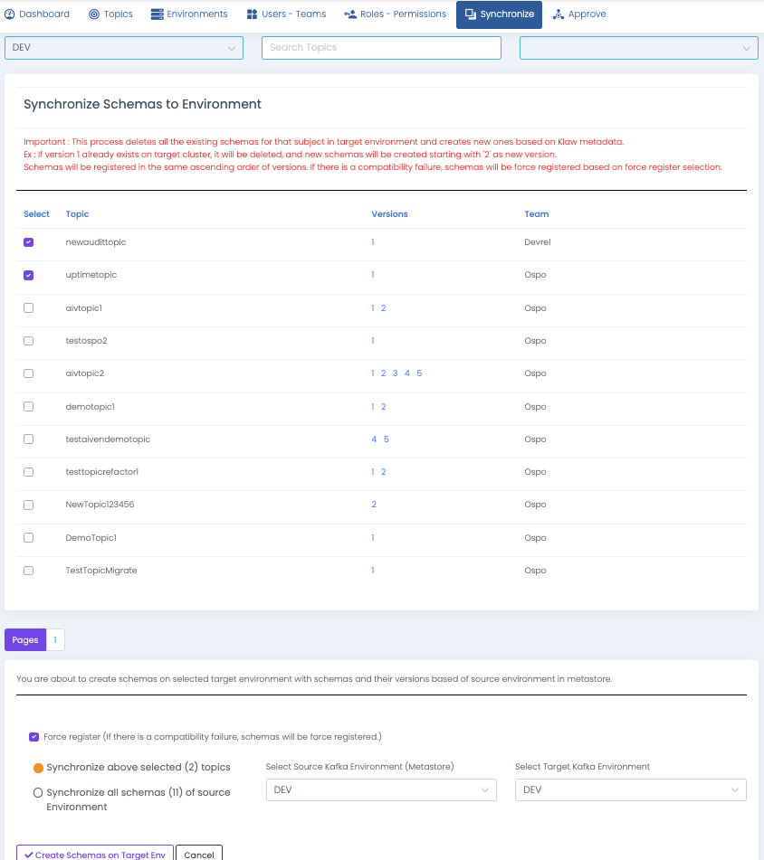

# Synchronize Schemas to cluster

To synchronize schemas from Klaw to a Schema Registry cluster, follow
the below steps, which involve displaying the topics and schema versions
in Klaw and creating them on the Schema Registry cluster.

:::note
During this process, all existing schemas for the subject in the target
environment are deleted, and new schemas are created based on Klaw
metadata. For example, if version 1 already exists in the target
cluster, it will be deleted, and new schemas will be created starting
with '2' as the new version. The schemas will be registered in
ascending order of versions. In case of compatibility failure, schemas
will be force registered based on the force register selection.
:::

1.  Log in as a SUPERADMIN or user with the `SYNC_BACK_SCHEMAS`
    permission.
2.  Navigate to the Synchronize menu and select **Schemas to Cluster**.
3.  To synchronize schemas, select the source environment (Klaw metadata
    with topics and schemas) and the target environment (Kafka cluster
    with the associated schema registry where the schemas need to be
    created).
4.  Select the force register checkbox in the event of compatibility
    failures, and you would still like to proceed with the sync.

By following these steps, you can synchronize schemas from a Klaw
metadata to a Schema Registry cluster.

:::note
This synchronization is primarily suitable for migrating to new schema
registry clusters.

