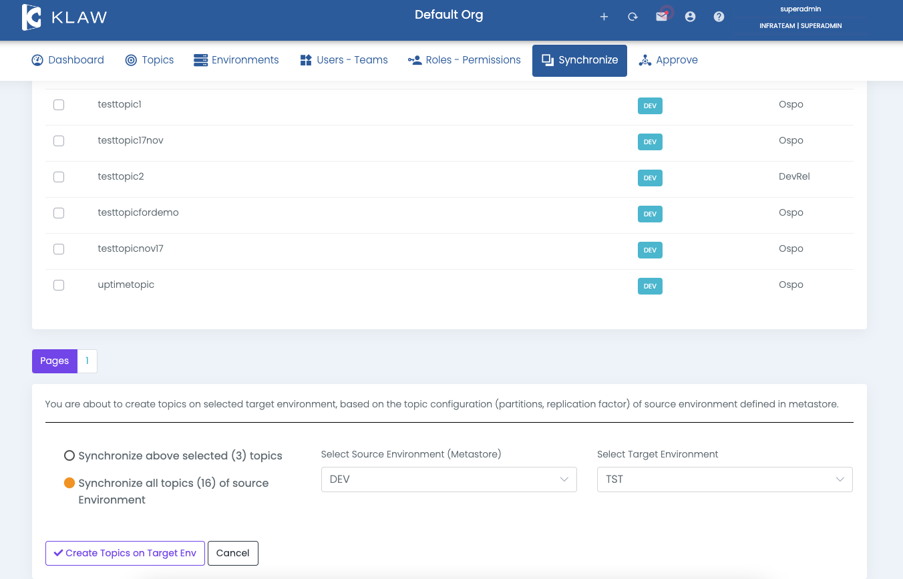

# Synchronize Topics to cluster

To synchronize topics from Klaw to an Apache Kafka cluster, follow the
below steps, which involve displaying the topics in Klaw and creating
them on the Apache Kafka cluster.

1.  Configure Environments and the `klaw.tenant.config` property as
    outlined in the [tenant-config](tenant-config)
    documentation.
2.  Log in as a SUPERADMIN or user with the `SYNC_BACK_TOPICS`
    permission.
3.  Navigate to the Synchronize menu and select **Topics to Cluster**.
4.  To synchronize topics, select the source environment (Klaw metadata
    with topics) and target environment (kafka cluster where topics have
    to be created).

If a topic already exists, you will see a `TopicAlreadyExistsException`,
which can be ignored, and you can proceed with the other topics.
