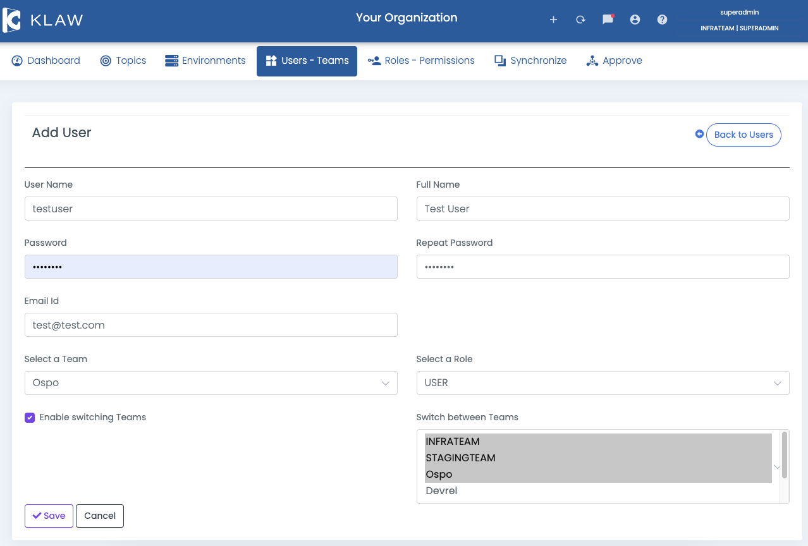

# Enable and use Switch Teams in Klaw

This section provides information on enabling the switch teams option
for user profiles in Klaw and key considerations to keep in mind.

-   You can enable the switch team option in a user's profile by
    logging in as a superadmin or a user with `ADD_EDIT_DELETE_USERS`
    permissions.
-   To switch between teams, users must have a list of available teams
    in their profile, including their base team and any other teams they
    can switch to.
-   Once the option to switch teams is enabled, users can easily switch
    between teams using the dropdown menu located in the header section
    of the Klaw portal.

    > A user who raises a request cannot approve the same request.

## Enable switch Teams for a user

To enable the switch teams functionality for a user profile, follow
these steps:

1.  Log in to Klaw as a superadmin or a user with the
    `ADD_EDIT_DELETE_USERS` permission.
2.  Go to **Users**, and select the **Edit** option for the user whose
    profile you want to modify.
3.  Check the **Enable Switching Teams** checkbox.
4.  Select at least two teams from the **Switch between Teams** multiple
    select listbox.
5.  Click **Save** to save your changes.

This enables the user to switch teams.

## Switch between Teams in Klaw

To switch between teams, follow these steps:

1.  Log in to Klaw using the credentials of a user whose profile has the
    **Enable switching Teams** option enabled.
2.  Locate the **Switch Teams** dropdown in the header section of the
    Klaw portal.
3.  Select a different team from the list of available teams in the
    dropdown.
4.  The base team of the user's profile will be updated automatically
    to reflect the selected team.

When you switch between teams, you can access various dashboards,
analytics, activity logs, and other relevant views associated with the
selected team. This enhances your flexibility when creating or approving
requests on Klaw.

:::note
Even after switching teams, the behavior of requests for topics, ACLs,
schemas, and connectors remains the same. Additionally, users are not
allowed to approve their own requests at any point.

