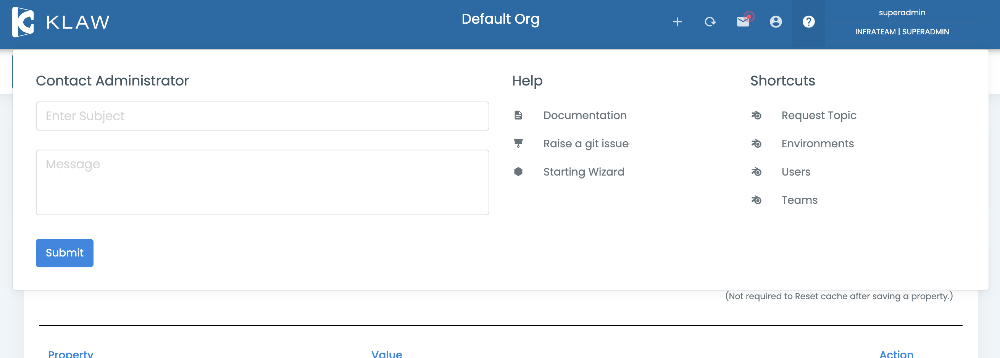

# Other features

-   Contact Administrator: It is possible to send a message to the
    Administrator of Klaw by clicking the help button on the top right
    of the screen.

-   Raise a GitHub Issue: If you find any issue with the project or have a
    suggestion or improvement, we recommend you submit an issue to the
    project. You can do this by clicking on help and selecting **Raise
    a git issue** option, or you can directly open an issue by accessing
    this link: <https://github.com/aiven/klaw/issues>
