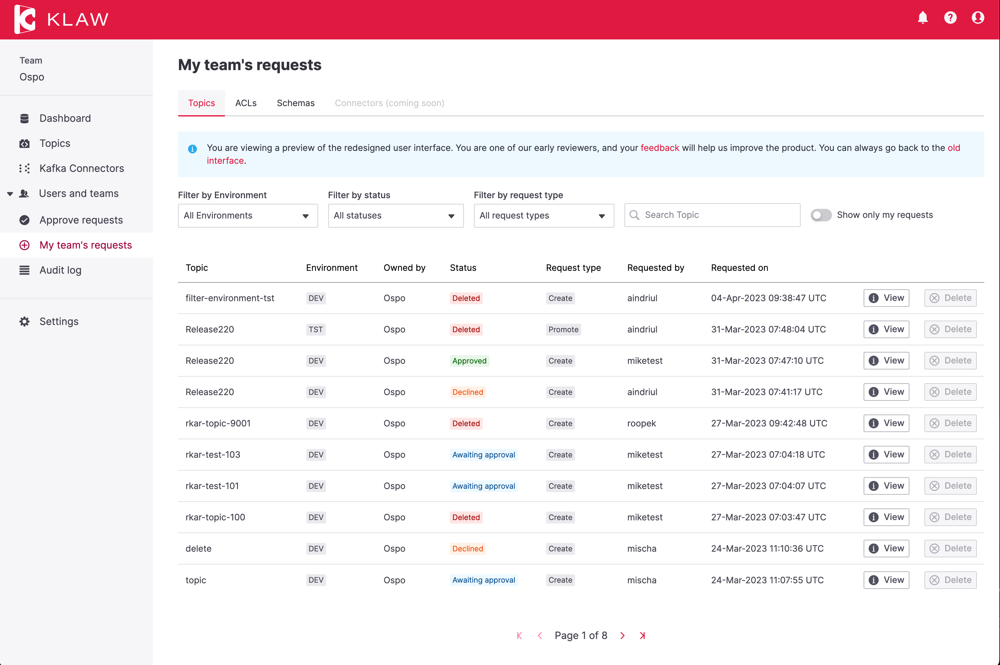

# Release 2.2.0

Date: 5th of April, 2023

## Overview

Klaw version 2.2.0 is a minor release with several new features and
improvements. Key highlights of this release include redesigned My
Team's Requests page, pre-validation of schema requests, sensitive ACL
data is now masked unless you are the owner and unified Kafka & Schema
cluster administration.

## What's new in Klaw 2.2.0

Redesigned My Team's Request screens with React UI
- With the switch to React, this release features a
redesign of the following user interfaces:

-   **My Team's Topic Requests**: Users can now view all of their
    team's topic requests using the new UI.
-   **My Team's Subscription Requests** (Producer/Consumer): Users can
    now view all of their team's ACL requests for both producers and
    consumers using the new UI.
-   **My Team's Schema Requests**: Users can now view all of their
    team's schema requests using the new UI.

To preview the new Klaw user interface, open the
`application.properties` file on the Klaw **core** module, and set the
value of the following property to `true`: 

    # Enable new Klaw user interface
    klaw.coral.enabled=true

:::note
We are taking an incremental, feedback-driven approach in rolling out
the new Klaw interfaces. By providing the feature flag to preview user
interfaces, we would like you to share your valuable
[feedback](https://github.com/aiven/klaw/issues/new?assignees=&labels=&template=03_feature.md).
:::

### Pre-validation of schema compatibility

Klaw will now check all schema compatibility against the Schema Registry
before creating the schema creation requests. This feature will only be
bypassed during promotion when the 'force register schema' option is
selected.

### Masking of ACL information for enhanced security 

To enhance security, Klaw now masks IP Addresses, certificates, and Service
Account credentials from all users except the ACL owner team. This
enhancement ensures that sensitive information is only visible to
authorized personnel, improving overall security.

### Export data to JSON

Klaw now allows administrators to export the database configuration and
data in three parts - admin data, requests data, and core data. This
feature provides administrators with additional backup and recovery
options, enabling them to manage the system more effectively.

For more information, see [Export Klaw
data](https://www.klaw-project.io/docs/howto/exportdata).

:::note
For a complete list of improvements, changelog, and to download the
release, see <https://github.com/aiven/klaw/releases/tag/v2.2.0>

