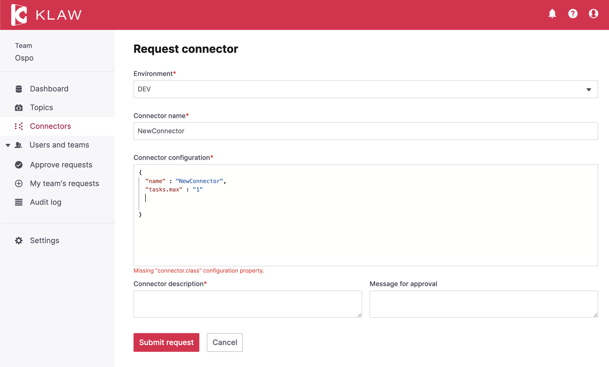
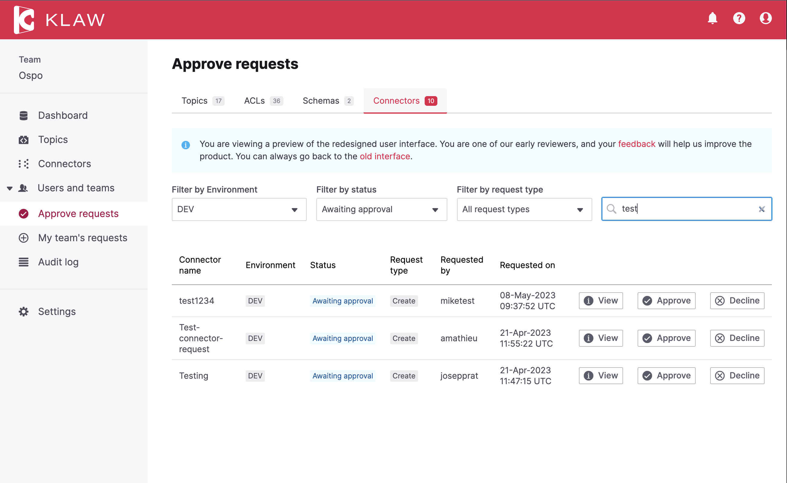

# Release 2.3.0

Date: 10th of May, 2023

## Overview

Klaw version 2.3.0 is a minor release with several new features and
improvements. Key highlights of this release include redesigned
Connectors interface, improved Topic Overview and Grouping of ACLs.

## What's new in Klaw 2.3.0

### Redesigned screens with React UI

In this release, we have redesigned some key user interfaces using React
to enhance user experience and provide a more intuitive design:

-   **Browse Connectors**: With the redesigned user interface for
    Connectors, you can now explore and filter the available connectors
    with a more intuitive and user-friendly interface.
-   **Request new Connector**: With the updated user interface, users
    can now easily submit a request for a new connector.
-   **Approve Connectors requests**: The new user interface makes
    approving or rejecting Connector requests easy. Access the *Approve
    requests - connectors* screen to quickly and effortlessly approve or
    reject requests.
-   **My team's Connectors requests**: In addition to viewing all
    connectors from the Connectors screen, you can now access an
    overview of your team's connector requests using our newly designed
    \"My team's requests\" interface. You can also quickly delete your
    own requests from this interface.
-   **Improved usability in forms**: We have improved our form
    submission process by always enabling the Submit buttons. If users
    click submit while required fields are incomplete or contain invalid
    inputs, error messages are displayed on all problematic fields. This
    improvement gives users more autonomy and improves the experience of
    those using assistive technologies.

To preview the new Klaw user interface, open the
`application.properties` file on the Klaw **core** module, and set the
value of the following property to `true`:

    # Enable new Klaw user interface
    klaw.coral.enabled=true

:::note
We are taking an incremental, feedback-driven approach in rolling out
the new Klaw interfaces. By providing the feature flag to preview user
interfaces, we would like you to share your valuable
[feedback](https://github.com/aiven/klaw/issues/new?assignees=&labels=&template=03_feature.md).
:::

### Group ACls

You can now group Access Control Lists (ACLs) by Team, making it easier
to view and manage all ACL information in a more concise and
user-friendly way.

### Topic Overview

The Klaw Topic overview has now been enchanced to display one
environment at a time for better readability and useability. A simple
drop-down allows users to switch between environments.

### Regex support on topics

You can now validate the topic name in your topic request using a regex
pattern. Previously, only prefix or suffix validation was available.

:::note
For a complete list of improvements, changelog, and to download the
release, see <https://github.com/aiven/klaw/releases/tag/v2.3.0>

