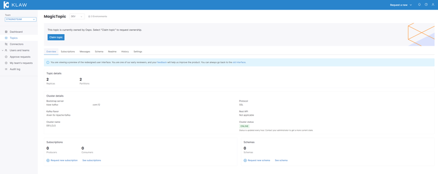
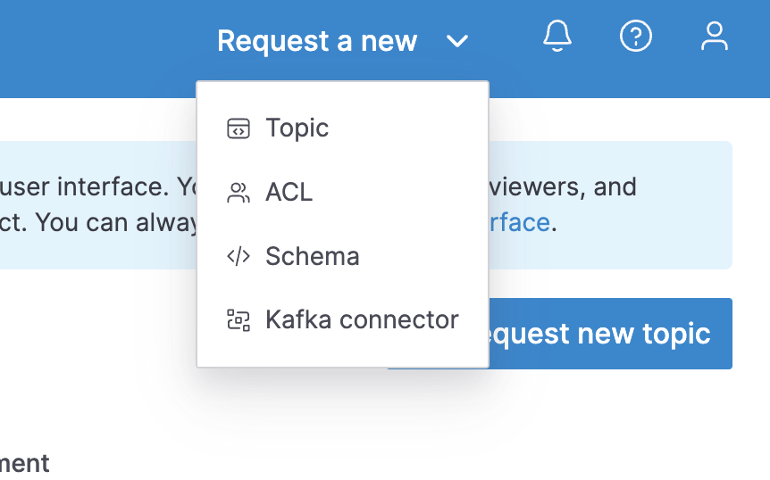

# Release 2.5.0

Date: 24th of August, 2023

## Overview

Klaw version 2.5.0 is a minor release with several new features and
improvements. Key highlights of this release include the ability to migrate
schemas from schema registry to Klaw, and vice versa.

## Download

### Binaries

[klaw-2.5.0.jar ⬇︎](https://github.com/Aiven-Open/klaw/releases/download/v2.5.0/klaw-2.5.0.jar)

[cluster-api-2.5.0.jar ⬇](https://github.com/Aiven-Open/klaw/releases/download/v2.5.0/cluster-api-2.5.0.jar)

### Sources

[klaw-2.5.0.zip ⬇](https://github.com/Aiven-Open/klaw/archive/refs/tags/v2.5.0.zip)

### Docker
[Klaw-core](https://hub.docker.com/r/aivenoy/klaw-core)
[Klaw-cluster-api](https://hub.docker.com/r/aivenoy/klaw-cluster-api)

## What's new in Klaw 2.5.0

### Redesigned screens with React UI

In this release, we have redesigned some key user interfaces using React
to enhance user experience and provide a more intuitive design:

-   Features
* New React UI: Topic Overview including capabilities to
  * Review topic details
  * Edit and promote topics
  * Create and promote new schemas
  * Add and review subscriptions (ACL) for the creation and retrieval of passwords
  * See history to provide an audit trail of the topic
  * See messages to view Kafka events on the topic
  * Add and edit documentation (now: "Readme") in markdown format
  * Claim topics

* New React UI: "Request new..." button
  * Allows creating a new topic, subscription, schema or Kafka connector from everywhere in the new UI 

* Import previously exported data back into Klaw
* Support for High Availability Caching

To disable the preview for the new Klaw user interface, open the
`application.properties` file on the Klaw **core** module, and set the
value of the following property to `false` (Effective from version 2.4.0, it
is true by default):

    #Enable new Klaw user interface
    klaw.coral.enabled=false

:::note
We are taking an incremental, feedback-driven approach in rolling out
the new Klaw interfaces. By providing the feature flag to preview the user
interfaces, we would like you to share your valuable
[feedback](https://github.com/aiven/klaw/issues/new?assignees=&labels=&template=03_feature.md).
:::

### Connector configuration encryption
This release introduces password encryption for fields in connector configuration.
The fields that are encrypted can be configured in the application.properties file.

### Editable Topic Requests
This release adds the ability to edit your topic requests to fix mistakes instead of deleting and recreating a whole new request.

### Key dependency updates
Kafka client upgrade to 3.5.1
Spring upgrade to 3.1.2

### Identify Schemas deleted from Schema Registry
The superadmin can now use the "Schemas From Cluster" functionality to identify Schemas that have been deleted from the Schema Registry.

### Bug Fixes

- [#1651](https://github.com/Aiven-Open/klaw/pull/1651) Postgres deployments now support count queries for Approval tabs in React UI
- #1569]() Promote OperationType now used for Schema promotion (previously "create")
  Enhancements
- [#1550](https://github.com/Aiven-Open/klaw/pull/1550) Improved email copy on new installations
- [#1414](https://github.com/Aiven-Open/klaw/pull/1414) Edit Topic can now also alter the Advanced Configuration
- [#1622](https://github.com/Aiven-Open/klaw/pull/1622) Promoted Connector not added to Cache
- [#1555](https://github.com/Aiven-Open/klaw/pull/1555) Superuser was able to access Coral UI
- [#1546](https://github.com/Aiven-Open/klaw/pull/1546) Promoted Schema Requests should use PROMOTE Request operation Type
- [#1591](https://github.com/Aiven-Open/klaw/pull/1591) Don't load users with empty passwords when auth type DB
- [#1521](https://github.com/Aiven-Open/klaw/pull/1521) Add topic to cache after it is added to Klaw via Synchronization
- [#1474](https://github.com/Aiven-Open/klaw/pull/1474) If deleting an ACL from Klaw that does not exist on the cluster executes successfully

:::note
For a complete list of improvements, changelog, and to download the
release, see <https://github.com/aiven/klaw/releases/tag/v2.5.0>