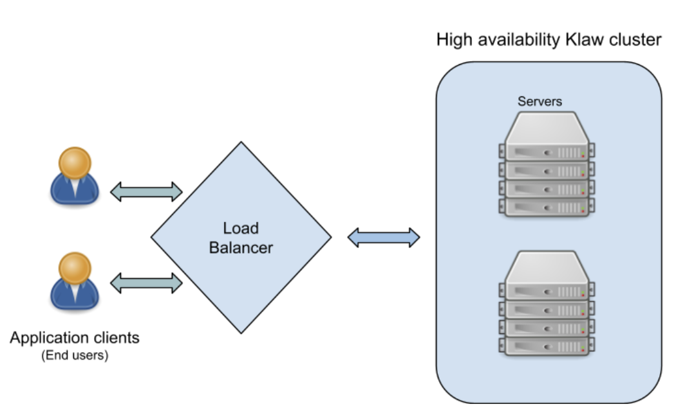

High Availability in Klaw
=========================

It is important to deploy every application in high availability mode in production environment, which assures either no downtime and/or balanced processing of requests.

Why is High Availability Important?
-----------------------------------

Being prepared for unforeseen events that can cause server failures is crucial in order to minimize interruptions and downtime. Even the most reliable software and systems can be brought down by emergencies. By implementing highly available systems, the impact of such events can be reduced, and these systems are often capable of automatically recovering from failures in components or servers.

High Availability Architecture
------------------------------

While it is undoubtedly crucial for systems to handle higher workloads and substantial traffic, it is equally vital to identify potential failure points and minimize downtime. A highly available load balancer plays a significant role in achieving this goal. It is a scalable infrastructure design that can adapt to increased traffic demands. This often involves employing a software architecture that surpasses hardware limitations.

How High Availability Works
---------------------------

Cache data in Klaw
------------------

