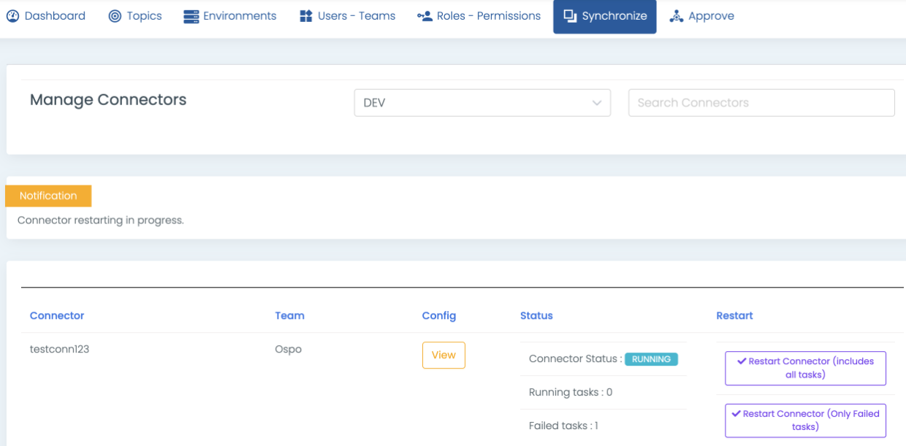

Manage connectors
=================

As an Administrator of Klaw and Kafka Connect, it is required to stop, start, restart Kafka connect in certain instances. Either in case of failing tasks or connectors or workers.

View/Restart Connectors status
------------------------------

1. When you login to Klaw, make sure you have permission 'MANAGE_CONNECTORS'
2. Go to menu Synchronize -> Manage connectors
3. Here in this page you will view the connectors status and their task status.
4. You can restart a Connector with all tasks included or only failed tasks included.

