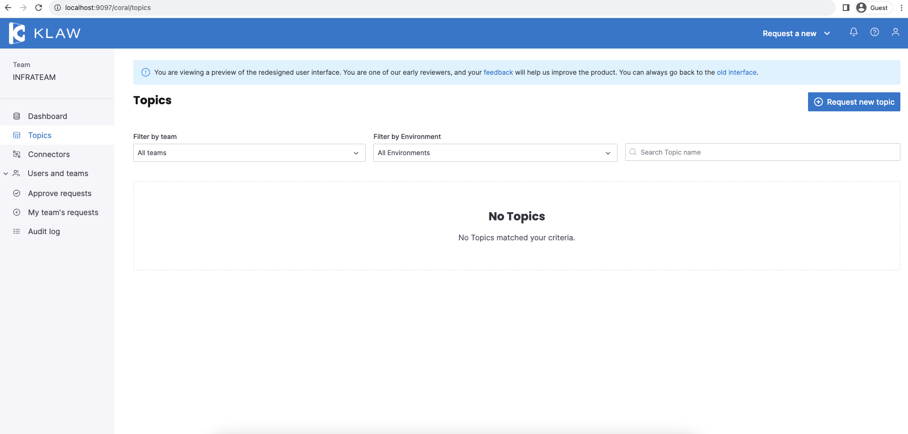
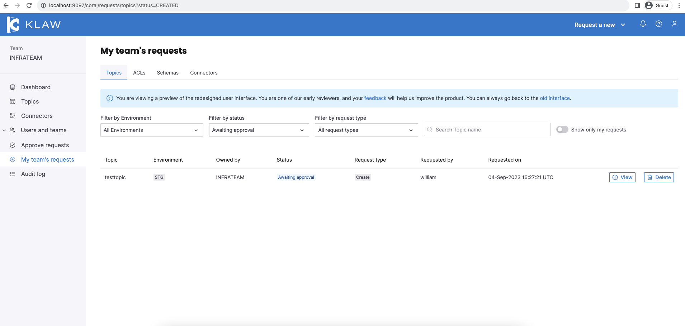
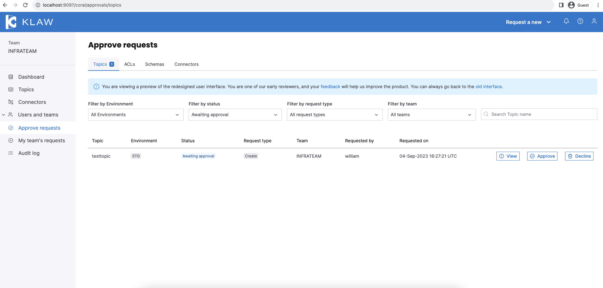

# Quick Start

In this tutorial, we will install Klaw with docker, and request for a kafka topic and verify its existence on kafka cluster.

## 1. Run the docker script

```typescript copy-button
docker run -d -t -i \
-e KLAW_CLUSTERAPI_ACCESS_BASE64_SECRET="dGhpcyBpcyBhIHNlY3JldCB0byBhY2Nlc3MgY2x1c3RlcmFwaQ==" \
-p 9343:9343 \
--name klaw-cluster-api aivenoy/klaw-cluster-api:nightly --add-host host.docker.internal:host-gateway \
&& docker run -d -t -i \
-e KLAW_CLUSTERAPI_ACCESS_BASE64_SECRET="dGhpcyBpcyBhIHNlY3JldCB0byBhY2Nlc3MgY2x1c3RlcmFwaQ==" \
-e KLAW_QUICKSTART_ENABLED=true \
-e SPRING_DATASOURCE_URL="jdbc:h2:file:/klaw/klawprodb;DB_CLOSE_ON_EXIT=FALSE;DB_CLOSE_DELAY=-1;MODE=MySQL;CASE_INSENSITIVE_IDENTIFIERS=TRUE;" \
-p 9097:9097 --name klaw-core aivenoy/klaw-core:nightly \
&& docker run -d -t -i -p 2181:2181 --add-host host.docker.internal:host-gateway \
-e ALLOW_ANONYMOUS_LOGIN=yes --name klaw-zookeeper bitnami/zookeeper:3.8 \
&& docker run -d -t -i -p 9092:9092 --add-host host.docker.internal:host-gateway \
-e KAFKA_CFG_ZOOKEEPER_CONNECT=host.docker.internal:2181 -e ALLOW_PLAINTEXT_LISTENER=yes \
-e KAFKA_ADVERTISED_LISTENERS=PLAINTEXT://host.docker.internal:9092 \
--name klaw-kafka bitnami/kafka:3.3 \
&& docker run -d -t -i -p 8081:8081 --add-host host.docker.internal:host-gateway \
-e SCHEMA_REGISTRY_KAFKA_BROKERS=PLAINTEXT://host.docker.internal:9092 \
--name klaw-schema-registry bitnami/schema-registry:latest
```

This script basically creates Klaw, Kafka and schema registry processes, and also configures Kafka and schema 
registry servers in Klaw.

## 2. Login to Klaw

After docker has started 5 processes, you may verify them by `docker ps`.
Now you may log into Klaw here  [http://localhost:9097/](http://localhost:9097/) with credentials `william : welcome`


## 3. Topics Catalog page

After logging in you will be redirected to our brand-new feature rich React UI.

You can "Request new Topic" from the top right corner, or you can select the dropdown "Request a new" to view all your options.



## 4. Request for topic


Fill in the details
- Select STG environment
- Fill in a topic name 'testtopic' for example
- Leave partitions, replication factor and advanced configuration to defaults
- Fill in text a topic description. 'Topic for demo' for example 
- Submit

This will create a topic request for your team member to approve.

## 5. View your request

Newly created topic request is now visible in My team's requests menu on the sidebar



## 6. Logout 

On the top right click on the profile and again click on the profile -> logout

william is now logged out.

## 7. Login again

Now login with credentials `jennifer : welcome`

## 8. Go to Approve requests page

From the menu, click on Approve requests menu.

## 9. Approve request

Here there is a pending request to be approved or declined. Click on view to review and Approve it.



## 10. That's it. Topic is created on Apache kafka cluster.

To verify

``` copy-button
docker exec -it klaw-kafka /opt/bitnami/kafka/bin/kafka-topics.sh --list --bootstrap-server localhost:9092
```

should display the newly created kafka topic. You can also try creating a schema for the topic from the "Request a new" dropdown.