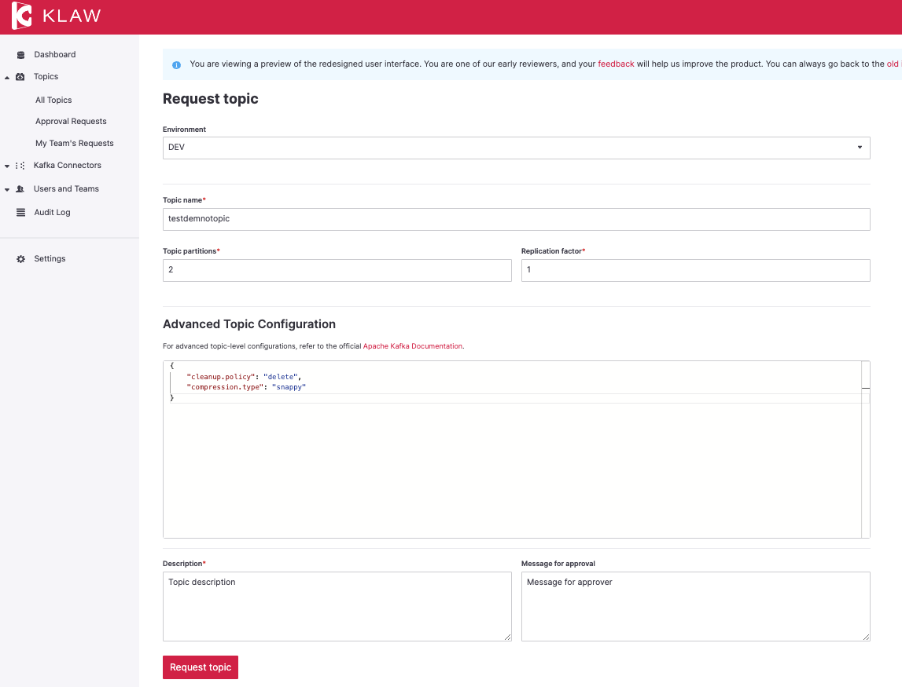

# Release 2.0.0

Date: 1st Feb, 2023

## Overview

Klaw version 2.0.0 is a major release with several new features and
improvements. Key highlights of this release include redesigned Request
screens in the React UI, Schema promotion, codebase optimizations, and
additional enhancements.

## Breaking changes

Java 11 Support discontinued: Klaw will no longer support Java 11.
Instead, Klaw now supports Java 17 (LTS) and Java 19 (latest).

## What's new in Klaw 2.0.0

### Redesigned Request screens with React UI

With the switch to React, this release features a redesign of the
following user interfaces:

- **Topic Request**: Users can now submit topic requests using the new
  UI.
- **Subscription Request** (Producer/Consumer): Users can now submit
  ACL requests for both producers and consumers using the new UI.
- **Schema Request**: Users can now submit schema requests using the
  new UI.

To preview the new Klaw user interface, open the
`application.properties` file on the Klaw **`core`** module, and set the
value of the following property to `true`:

    # Enable new Klaw user
    interface klaw.coral.enabled=true

:::note
We are taking an incremental, feedback-driven approach in rolling out
the new Klaw interfaces. By providing the feature flag to preview user
interfaces, we would like you to share your valuable
[feedback](https://github.com/aiven/klaw/issues/new?assignees=&labels=&template=03_feature.md).
:::

### Schema promotion

Users can now promote their schemas from lower to higher environments.
They can select a specific version of the schema and submit a request
for approval. Once the request is approved, the schema will be created
in the target environment. Additionally, there is now an option to
force-register the schema in case of any compatibility issues during
registration.

For more information, see [Schema
promotion](../../docs/workflows/schema/promote-schema).

### Authorization from OAuth2 Provider/Active Directory

With this release, users can now be authorized through an OAuth2
Provider or Active Directory. Roles for users can be defined in the
provider, such as grants in Azure Active Directory, and Klaw will
validate and assign these roles to users during the sign-up process.

For more information, see
[Authorization](../../docs/authentication-authorization/authorization.md).

To enable the authorization feature, set the below property to value
`true` in the `application.properties` file: :

    klaw.enable.authorization.ad = true

:::note
For a complete list of improvements, changelog, and to download the
release, see [GitHub release tag v2.0.0](https://github.com/aiven/klaw/releases/tag/v2.0.0)
