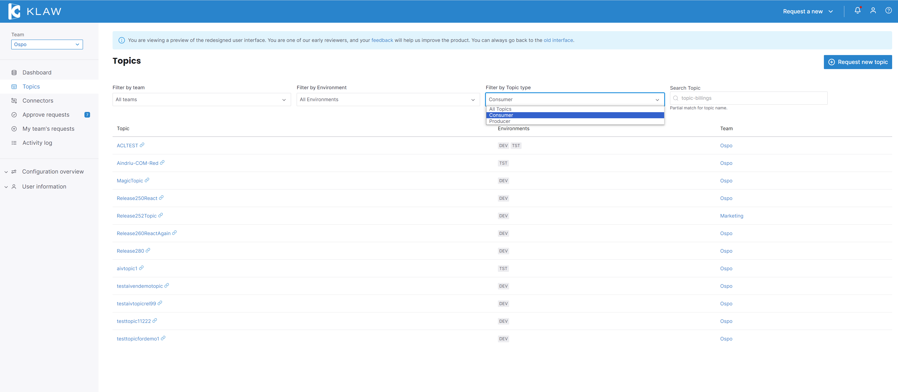
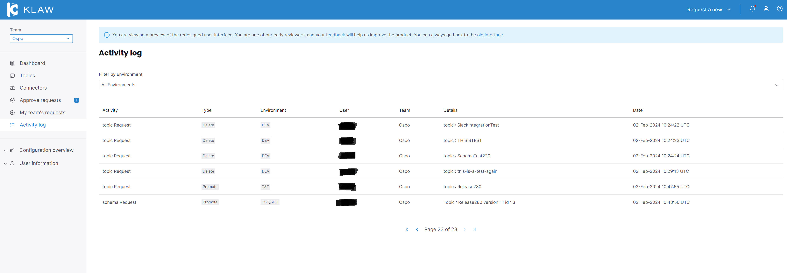
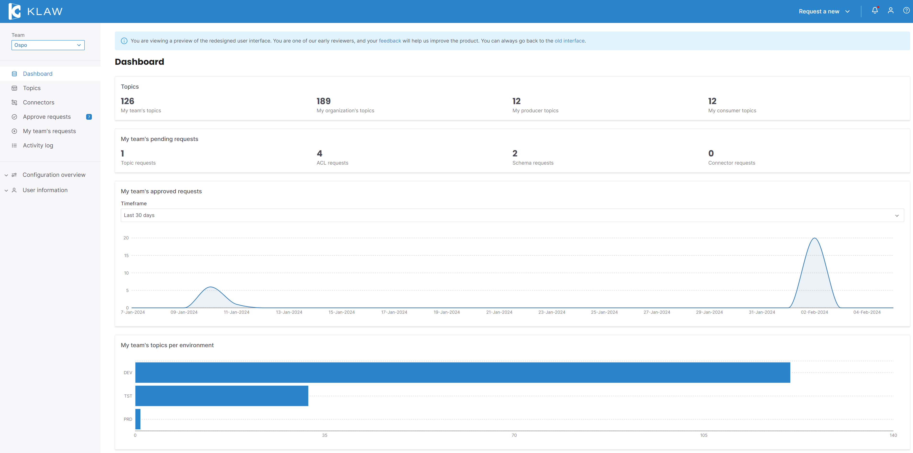
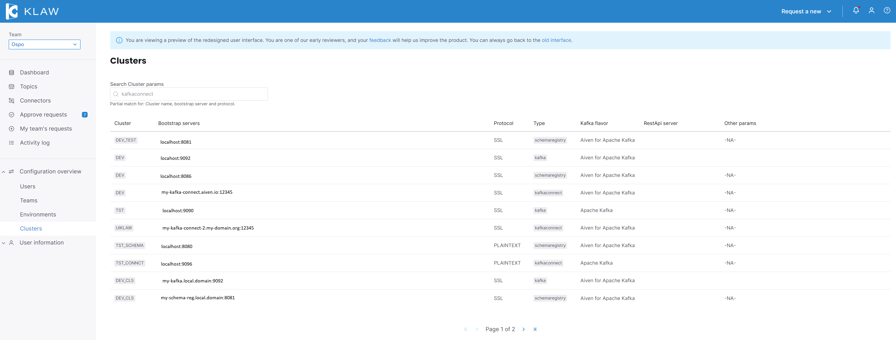
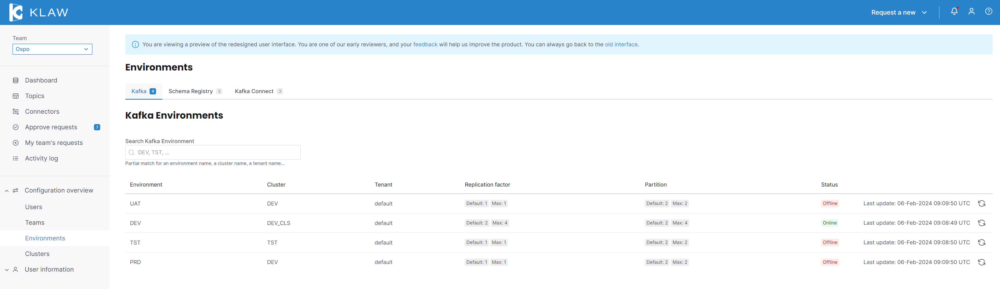

# Release 2.9.0

Date: 8th of April, 2024

## Overview

Overview
Klaw version 2.9.0 is a patch release which fixes an issue introduced in 2.8.0 with some minor bug fixes and improvements.

## Download

### Binaries

[`klaw-2.9.0.jar` ⬇︎](https://github.com/Aiven-Open/klaw/releases/download/v2.9.0/klaw-2.9.0.jar)

[`cluster-api-2.9.0.jar` ⬇](https://github.com/Aiven-Open/klaw/releases/download/v2.9.0/cluster-api-2.9.0.jar)

### Sources

[`klaw-2.9.0.zip` ⬇](https://github.com/Aiven-Open/klaw/archive/refs/tags/v2.9.0.zip)

### Docker

- [Klaw Core](https://hub.docker.com/r/aivenoy/klaw-core)
- [Klaw Cluster API](https://hub.docker.com/r/aivenoy/klaw-cluster-api)

## What's new in Klaw 2.9.0

### Redesigned screens with React UI

In this release, we have redesigned the user interface using React to enhance the user experience and provide a more intuitive design.

Key updates in the new React UI include:

- Topic catalog - Filter by Topic type
  
- Activity log
  
- Dashboard landing page
  
- View clusters
  
- View environments
  

To disable the preview for the new Klaw user interface, open the
`application.properties` file on the Klaw **core** module, and set the
value of the following property to `false` (Effective from version 2.4.0, it
is true by default):

```properties
    #Enable new Klaw user interface
    klaw.coral.enabled=false
```

:::note
We are taking an incremental, feedback-driven approach in rolling out
the new Klaw interfaces. By providing the feature flag to preview the user
interfaces, we would like you to share your valuable
[feedback](https://github.com/aiven/klaw/issues/new?assignees=&labels=&template=03_feature.md).
:::

### JSON Schema support in Coral and Angular

Klaw now supports provisioning JSON Schemas through both the Angular and React UI. Previously only Schemas of type Avro were supported.

### BETA Release of ACL Claim functionality

We are pleased to announce the Beta release of Claim ACL/Subscription functionality. This functionality still has some limitations that we will be improving in upcoming releases.
Please see the ACL Claim page for more information on these limitations.

### Improvements

- Admin Guards on all APIs for roles for enhanced security and enhanced user feedback
- Delete Service Users when ACLs are deleted
- Declined User requests can be reused

### Bug fixes

- Allow creating new users with an email address as a username
- Fix the default schema version on promote to be an informational message in angular UI
- Fix unused script and unsafe links
- Fix target=blank vulnerability

### DB upgrade

In this release, there is a new primary key added to the "kwregisterusers" table to allow previously denied usernames to be re-used in future requests.

:::note
For a complete list of improvements, changelog, and to download the
release, see [GitHub release tag v2.9.0](https://github.com/aiven/klaw/releases/tag/v2.9.0)
