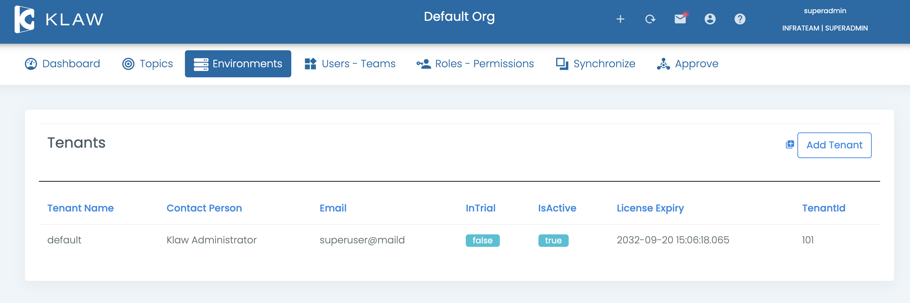

# Tenant configuration

A Tenant, in Klaw terminology, is an isolated Klaw environment with its
own clusters, environments, users, teams, topics, etc. Users of one
tenant are isolated from other tenants. They cannot view topics or any
information of other tenants, even though they share the same Klaw
instance.

Every installation of Klaw comes with a single (default) tenant.



## Add new tenant

To add a new tenant, a superadmin or user with the `ADD_TENANT`
permission can do so under the **Environments -\> Tenants** menu.

:::note
If the application should be limited to only one tenant, you can
configure it with the below property in `application.properties` file.

     #maximum tenants can be created
     klaw.max.tenants=200

:::

## Configure a tenant

You can configure the following in a tenant:

- Base sync environment

  This is the base Apache Kafka® environment in a hierarchy of
  environments. Make sure this environment already exists under
  Environments (Apache Kafka).

  Field: `baseSyncEnvironment`

- Order of Apache Kafka topics promotion environments

  Define a set of environments to promote a
  Apache Kafka topic. Ex: \[\"DEV\", \"TST\"\]. Make sure this
  environment already exists under Environments (Apache Kafka)

      Field: `orderOfTopicPromotionEnvsList`

- Request topics Environments List

  Define a set of environments for which Apache Kafka topics can be
  requested directly. Other environments cannot be requested
  directly, and topics can only be promoted to them.

      Field: `requestTopicsEnvironmentsList`

- Base sync environment Apache Kafka Connect

  This is the base Apache Kafka Connect environment in a hierarchy of
  environments. Make sure this environment already exists under
  Environments (Apache Kafka Connect).

      Field: `baseSyncKafkaConnectCluster`

- Order of Apache Kafka Connect promotion environments

  Define a set of environments to promote a Apache Kafka connector.
  Ex: \[\"DEV\", \"TST\"\].
  Make sure this
  environment already exists under Environments (Apache Kafka Connect)

      Field: `orderOfConnectorsPromotionEnvsList`

- Request connectors Environments List

  Define a set of environments for which Apache Kafka connectors can be
  requested directly. Other environments cannot be requested
  directly, and connectors can only be promoted to them.

      Field: `requestConnectorsEnvironmentsList`

  Sample Tenant configuration for Property: `klaw.tenant.config`:

  ```json
  {
    "tenantModel": {
      "tenantName": "default",
      "baseSyncEnvironment": "DEV",
      "orderOfTopicPromotionEnvsList": ["DEV", "TST"],
      "requestTopicsEnvironmentsList": ["DEV", "TST"],
      "baseSyncKafkaConnectCluster": null,
      "orderOfConnectorsPromotionEnvsList": [],
      "requestSchemaEnvironmentsList": [],
      "requestConnectorsEnvironmentsList": []
    }
  }
  ```

You can configure the above configurations under **Dashboard** -\>
**Settings** with a SUPERADMIN role or a user with the
`UPDATE_SERVERCONFIG` permission.
