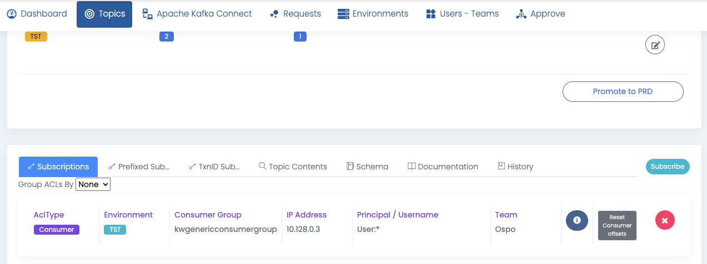
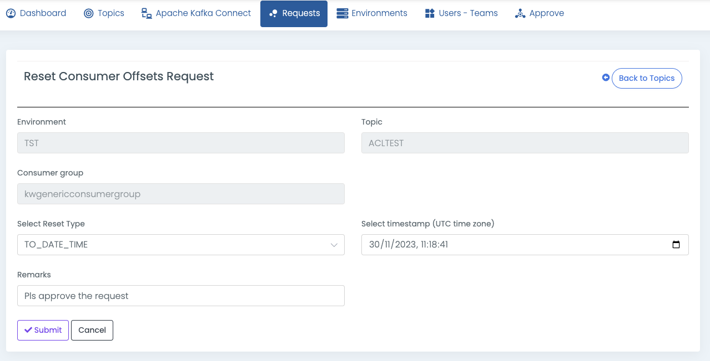

# Reset consumer group offsets

If you encounter any errors, failures, or deserialization issues while using Apache Kafka® consumers, you may need to reprocess messages. To address this, Apache Kafka® offers a command-line tool called `kafka-consumer-groups`.

Similarly, Klaw allows resetting consumer group offsets via its interface.

Before you begin, ensure that you are the owner of the Consumer ACL for the consumer group you wish to reset.

## Submit a reset consumer group offsets request

1. Select the topic for which you need to reset the offsets.

2. In the **Topic overview** page, select the correct environment for your topic.

3. On the **Subscriptions** tab, select the relevant consumer ACL and consumer group record.

4. You will see the **Reset Consumer Offsets** button if you are the consumer ACL owner.

   

5. Select the button to open a form with three reset options:
   - LATEST: Resets to the most recent consumed message.
   - EARLIEST: Resets to the earliest available message.
   - TO_DATE_TIME: Resets to the oldest message consumed before a specific timestamp.

     

6. Upon submission, a request is generated, requiring approval from the Consumer ACL Owner team. Once approved, offsets are reset, and users are notified.
