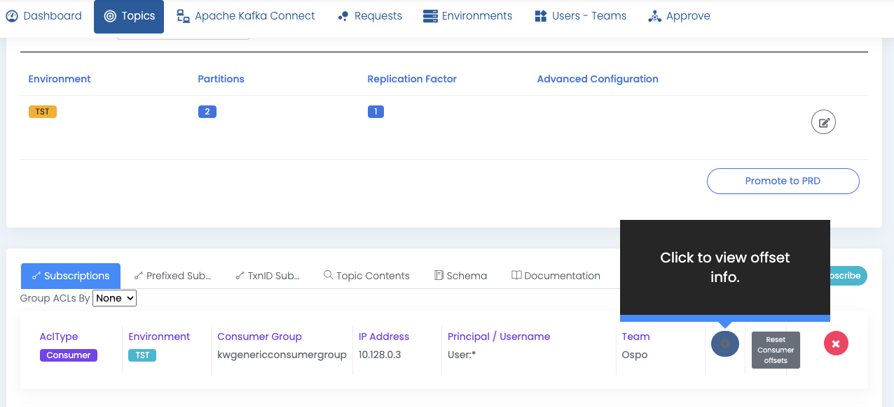

# View Consumer Lag

Consumer lag in Apache Kafka® refers to the delay between the production and consumption of messages. This delay happens when messages are produced to a topic at a faster rate than they are consumed. To monitor lag, Apache Kafka® provides a command-line interface called `kafka-consumer-groups`, which can be used to check the lag for each topic partition.
Similarly, Klaw allows you to monitor this lag using the Klaw interface.

## How to view the consumer lag in Klaw

1. Select the topic on which you want to view the lag.
2. In the **Topic overview**, select the correct environment for your topic.
3. Locate the consumer ACL record, which your team owns.
4. Click on the **Click to view offset info** button. This will display the consumer lag for each partition of the selected topic, allowing you to monitor the lag using the Klaw interface.

   
