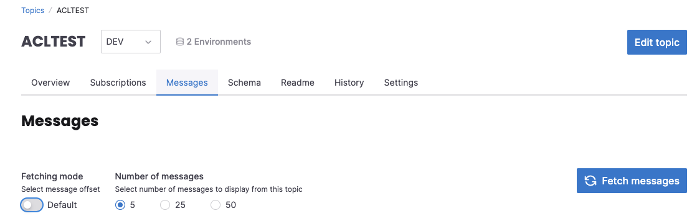
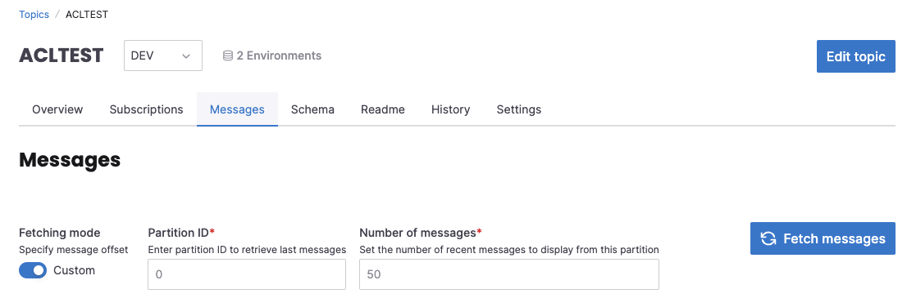

# View topic events in Klaw

Klaw enables users to view actual events on a topic, provided the messages are unencrypted.

## Prerequisites

- You must be a member of the topic owner team to view events.
- You need to use the new Klaw user interface to view events.

:::note
This feature may not be available in the old Klaw UI.
:::

## How to view events

1. Select the topic for which you want to view events using the new Klaw interface.
2. In the **Topic overview** tab, select the right environment for your topic.
3. Next, select the **Messages** tab.
4. Choose a fetching mode:

   - **Default mode:** Select the number of messages you wish to display. This mode shows the latest messages from the topic's partitions.
     
   - **Custom mode:** Enter a partition ID and specify the number of messages you want to display from that partition.
     

   :::note
   Ensure the `klaw.topiccontents.consumergroup.id` property is enabled in the cluster-API application, and adjust the consumer group value as needed. Additionally, create an ACL that allows this consumer group to read messages from the Klaw host machine.
   :::

5. After making your selection, messages are displayed. If you wish to view updated or additional messages later, click **Fetch messages**.
